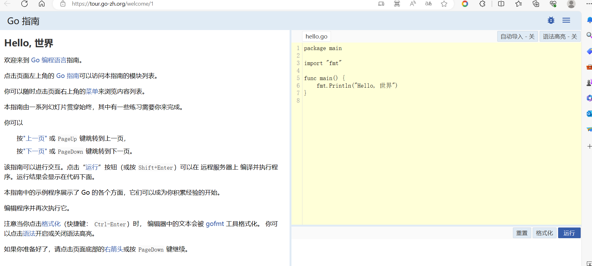
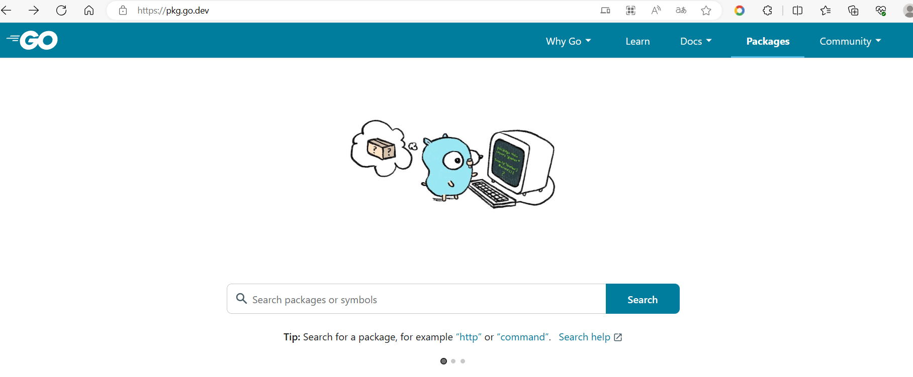
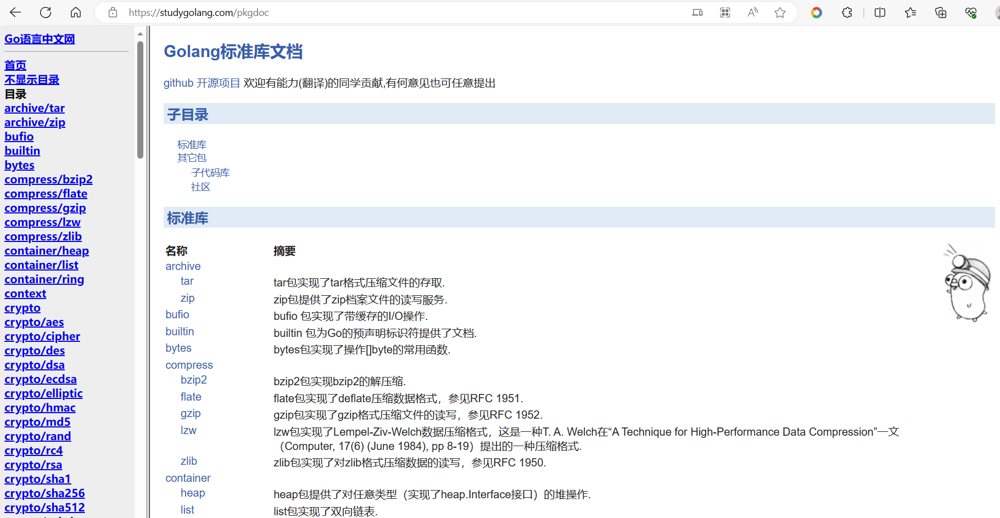

# go命令
```go
// 编译，window会编译成.exe的可执行文件
go build hello.go
// 编译，指定文件名
go build -o myhello.exe hello.go
// 直接运行，速度会慢些，不会生成可执行文件
go run hello.go
```

# Golang 执行流程分析
## 1. 先编译，再执行
.go文件  ->

# Go 程序开发的注意事项
1) Go 源文件以 "go" 为扩展名。
2) Go 应用程序的执行入口是 main()函数。 这个是和其它编程语言（比如java/c）
3) Go 语言严格区分大小写。
4) Go 方法由一条条语句构成，每个语句后不需要分号(Go 语言会在每行后自动加分号)，这也体现出 Golang 的简洁性。
5) Go 编译器是一行行进行编译的，因此我们一行就写一条语句，不能把多条语句写在同一个，否则报错
6) go 语言定义的变量或者 import 的包如果没有使用到，代码不能编译通过。
7) 大括号都是成对出现的，缺一不可。

# go语言的转移字符
说明:常用的转义字符有如下:
1) \t : 表示一个制表符，通常使用它可以排版。
2) \n ：换行符
3) \\ ：一个\
4) \" ：一个"
5) \r ：一个回车 fmt.Println("天龙八部雪山飞狐\r 张飞");

# go的注释

## 介绍注释
用于注解说明解释程序的文字就是注释，**注释提高了代码的阅读性**；
注释是一个程序员必须要具有的良好编程习惯。将自己的思想通过注释先整理出来，再用代码去体现。

## 注释的方式
- 行注释 [推荐使用]
> // 注释内容
- 块注释（多行注释）
> /*
>
> */

## 使用细节
1) 对于行注释和块注释，被注释的文字，不会被 Go 编译器执行。
2) 块注释里面不允许有块注释嵌套 [注意一下]

# 规范的代码风格

## 正确的注释和注释风格：
1) Go 官方推荐使用行注释来注释整个方法和语句。
2) 带看 Go 源码

## 正确的缩进和空白
1) 使用一次 tab 操作，实现缩进,默认整体向右边移动，时候用 shift+tab 整体向左移
2) 或者使用 gofmt 来进行格式化 [演示]
3) 运算符两边习惯性各加一个空格。比如：2 + 4 * 5。
    ```go
    var num = 2 + 4 * 5
    ```
4) Go 语言的代码风格
    ```go
    package main
    import "fmt"
    func main() {
        fmt.Println("hello world")
    }
    // 不允许下面这样写
    package main
    import "fmt"
    func main() 
    {
        fmt.Println("hello world")
    }
    ```
    Go 设计者思想: **一个问题尽量只有一个解决方法**
    
5) 一行最长不超过 80 个字符，超过的请使用换行展示，尽量保持格式优雅

# go官方编程指南

https://tour.go-zh.org/welcome/1



https://pkg.go.dev/

查询包的用法



https://studygolang.com/pkgdoc（标准库文档）

