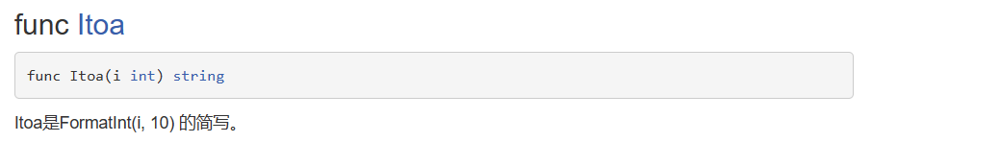
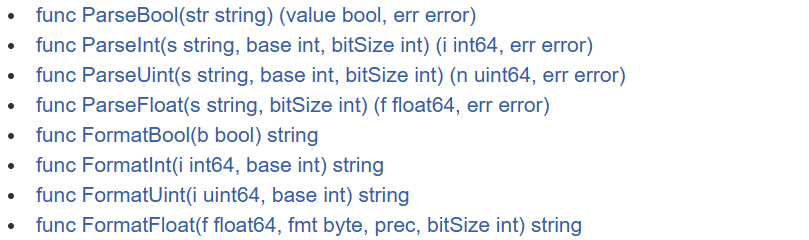

# 1. 为什么需要变量？

## 1.1 一个程序就是一个世界

## 1.2 变量是程序的基本组成单位

不论是使用哪种高级程序语言编写程序,变量都是其程序的基本组成单位

```go
func getVal(num1 int, num2 int) (int, int) {
	sum := num1 + num2
	sub := num1 - num2
	return sum, sub
}
```

比如上图的 sum,sub 都是变量。

# 2. 变量的介绍

## 2.1 变量的概念

变量相当于内存中一个数据存储空间的表示，你可以把变量看做是一个房间的门牌号，通过门牌号我们可以找到房间，同样的道理，通过变量名可以访问到变量(值)。

## 2.2 变量的使用步骤

1) 声明变量(也叫:定义变量) 
2) 非变量赋值 
3) 使用变量

## 2.3 变量快速入门案例

```go
func test1() {
    // 定义变量
    var i int
    // 给变量赋值
    i = 10
    // 使用变量
    fmt.Println(i)
}
```

## 2.4 变量使用注意事项

### 2.4.1 变量表示内存中的一个存储区域 

### 2.4.2 该区域有自己的名称（变量名）和类型（数据类型） 示意图：


### 2.4.3 Golang 变量使用的三种方式

​	(1) 第一种：指定变量类型，**声明后若不赋值，使用默认值**

```go
func test1Var1() {
    // 第一种：声明后不赋值，使用默认值
    var i int
    // 使用变量
    fmt.Println("i=", i)
}
```

​	(2) 第二种：根据值自行判定变量类型(**类型推导**)

```go
func test1Var2() {
    // 第二种：根据值自行判断类型
    var num = 10.11
    // 使用变量
    fmt.Println("num=", num)
}
```

​	(3) 第三种：省略 var, 注意 :=左侧的变量不应该是已经声明过的，否则会导致编译错误

```go
func test1Var3() {
    // 第三种：省略 var, 注意 :=左侧的变量不应该是已经声明过的，否则会导致编译错误
    name := "liufei"
    // 使用变量
    fmt.Println("name=", name)
}
```

### 2.4.4 多变量声明

在编程中，有时我们需要一次性声明多个变量，Golang 也提供这样的语法

```go
func moreVar() {
    // 声明多个变量
    //var n1, n2, n3 int
    //fmt.Println("n1=", n1, "n2=", n2, "n3=", n3)

    // 一次性声明多个变量的方式2
    //var n1, name, n3 = 100, "tom", 888
    //fmt.Println("n1=", n1, "name=", name, "n3=", n3)

    // 一次性声明多个变量的方式3
    n1, name, n3 := 100, "tom=", 888
    fmt.Println("n1=", n1, "name=", name, "n3=", n3)
}
```
如何一次性声明多个全局变量【在 go 中函数外部定义变量就是全局变量】：
```go
// 定义全局变量
var n1 = 100
var n2 = 200
var name = "liufei"

// 上面的声明方式，也可以改成一次性声明
var (
    n3    = 300
    n4    = 900
    name2 = "mary"
)
```

### 2.4.5 该区域的数据值可以在同一类型范围内不断变化(重点)

```go
func changeVar() {
    var i int = 10
    i = 30
    i = 50
    fmt.Println("i=", i)
    // i = 1.2 // int ，议案因不能改变数据类型
}
```

### 2.4.6 变量在同一个作用域(在一个函数或者在代码块)内不能重名

### 2.4.7 变量=变量名+值+数据类型

这一点请大家注意，变量的三要素

### 2.4.8 Golang 的变量如果没有赋初值，编译器会使用默认值

比如 int 默认值0 string 默认值为空串，小数默认为 0

```go
func defaultVar() {
    var i int
    var bol bool
    var name string
    var flo = float32(0.0)
    fmt.Println("i=", i)  // 0
    fmt.Println("bol=", bol)  // false
    fmt.Println("name=", name) // 空串
    fmt.Println("flo=", flo) // 0
}
```

## 2.5. 变量的声明，初始化和赋值


## 2.6 程序中 +号的使用

1) 当左右两边都是数值型时，则做加法运算 
2) 当左右两边都是字符串，则做字符串拼接

## 2.7 数据类型的基本介绍


## 2.8 整数类型

### 2.8.1 基本介绍

简单的说，就是用于**存放整数值**的，比如 0, -1, 2345 等等。

### 2.8.2 案例演示

### 2.8.3 整数的各个类型

| 类型  | 有无符号 | 占用存储空间 | 表数范围          | 对比Java |
| ----- | -------- | ------------ | ----------------- | -------- |
| int8  | 有       | 1字节        | -127 ~ 127        | byte     |
| int16 | 有       | 2字节        | -2^15 ~  2^15 - 1 | short    |
| int32 | 有       | 4字节        | -2^31 ~  2^31 - 1 | int      |
| int64 | 有       | 8字节        | -2^63 ~  2^63 - 1 | long     |

int 的无符号的类型：

| 类型   | 有无符号 | 占用存储空间 | 表数范围      | 对比Java |
| ------ | -------- | ------------ | ------------- | -------- |
| uint8  | 无       | 1字节        | 0 ~ 255       |          |
| uint16 | 无       | 2字节        | 0 ~  2^16 - 1 | char     |
| uint32 | 无       | 4字节        | 0 ~  2^32 - 1 |          |
| uint64 | 无       | 8字节        | 0 ~  2^64 - 1 |          |

int 的其它类型的说明:

| 类型 | 有无符号 | 占用存储空间                         | 表数范围                                 | 备注                            |
| ---- | -------- | ------------------------------------ | ---------------------------------------- | ------------------------------- |
| int  | 有       | 32位系统4个字节<br />64位系统8个字节 | -2^31 ~  2^31 - 1<br />-2^63 ~  2^63 - 1 |                                 |
| uint | 无       | 32位系统4个字节<br />64位系统8个字节 | 0 ~  2^32 - 1<br />0 ~  2^64 - 1         |                                 |
| rune | 有       | 与int32一样                          | -2^31 ~  2^31 - 1                        | 等价于int32，表示一个Unicode 码 |
| byte | 无       | 与int8一样                           | 0 ~  255                                 | 当要存储字符时，选用byte        |

```go
func intDemo1() {
	var i int = 10
	fmt.Println("i=", i)

	var j int8 = 127
	fmt.Println("j=", j)

	var k uint8 = 255
	fmt.Println("k=", k)

	var b uint = 1
	fmt.Println("b=", b)

	var c byte = 255
	fmt.Println("c=", c)
}
```

### 2.8.4 整型的使用细节

1) Golang 各整数类型分：有符号和无符号，int uint 的大小和系统有关。

2) Golang 的整型默认声明为 int 型

   ```go
   func intDemo2() {
       // 整型的使用细节
       var n1 = 10 // ? n1 是什么类型
       // 这里我们给介绍一下如何查看某个变量的数据类型
       fmt.Printf("n1 的类型 %T \n", n1) // n1 的类型 int
   }
   ```

3) 如何在程序查看某个变量的字节大小和数据类型 （使用较多）

   ```go
   // 如何在程序查看某个变量的字节大小和数据类型 （使用较多）
   func intDemo3() {
       var n2 int64 = 10
       fmt.Printf("n2 的类型 %T  n2占用的字节数是 %d ", n2, unsafe.Sizeof(n2)) // n2 的类型 int64  n2占用的字节数是 8
   }
   ```

4) Golang 程序中整型变量在使用时，遵守保小不保大的原则，即：在保证程序正确运行下，尽量使用占用空间小的数据类型。【如：年龄】

   ```go
   var age byte = 90
   ```

5) bit: 计算机中的最小存储单位。byte: 计算机中基本存储单元。[二进制再详细说] 1byte =8bit

## 2.9 小数类型/浮点型

### 2.9.1 基本介绍

小数类型就是用于存放小数的，比如 1.2 0.23 -1.911

### 2.9.2 案例演示

```go
import "fmt"

func main() {
    var price float32 = 89.12
    fmt.Println("price=", price)
}
```

### 2.9.3 小数类型分类

| 类型          | 占用存储空间 | 表数范围             |
| ------------- | ------------ | -------------------- |
| 单精度float32 | 4字节        | -3.403E38~3.403E38   |
| 双精度float64 | 8字节        | -1.798E308~1.798E308 |

对上图的说明:

**1. 关于浮点数在机器中存放形式的简单说明,浮点数=符号位+指数位+尾数位**

说明：浮点数都是有符号的

```go
func floatDemo1() {
    var num1 float32 = -0.0089
    var num2 float64 = -7809656.09
    fmt.Println("num1=", num1, "num2=", num2)
}
```

**2.尾数部分可能丢失，造成精度损失。-123.0000901**

```go
// 造成精度损失
func floatDemo2() {
    var num3 float32 = -123.0000901
    var num4 float64 = -123.0000901
    fmt.Println("num3=", num3, "num4=", num4) // num3= -123.00009 num4= -123.0000901
}
```

说明：float64 的精度比 float32 的要准确.

说明：如果我们要保存一个精度高的数，则应该选用 float64

**3.浮点型的存储分为三部分：符号位+指数位+尾数位 在存储过程中，精度会有丢失**

### 2.9.4浮点型使用细节

**1.Golang 浮点类型有固定的范围和字段长度，不受具体 OS(操作系统)的影响。**

**2.Golang 的浮点型默认声明为 float64 类型。**

```go
// 默认是float64
func floatDemo3() {
    var num5 = -123.0000901
    fmt.Printf("num5的数据类型是 %T \n", num5) // num5的数据类型是 float64
}
```

**3.浮点型常量有两种表示形式**

十进制数形式：如：5.12    .512 (必须有小数点）

科学计数法形式:如：5.1234e2 = 5.12 * 10 的 2 次方       5.12E-2 = 5.12/10 的2 次方

```go
// 浮点型常量的表示形式
func floatDemo4() {
    num6 := 5.12
    num7 := .123                              // => 0.123
    fmt.Println("num6=", num6, "num7=", num7) // num6= 5.12 num7= 0.123

    // 科学计数法
    num8 := 5.1234e2   // ? 5.1234 * 10 的2次方
    num9 := 5.1234e2   // ? 5.1234 * 10 的2次方
    num10 := 5.1234e-2 // ? 5.1234 / 10 的2次方
    fmt.Println("num8=", num8, "num9=", num9, "num10=", num10) // num8= 512.34 num9= 512.34 num10= 0.051234
}
```

**4.通常情况下，应该使用 float64 ，因为它比 float32 更精确。[开发中，推荐使用float64]**

## 2.10 字符类型

### 2.10.1 基本介绍

Golang 中没有专门的字符类型，如果要存储单个**字符**(字母)，一般使用**byte 来**保存。

**字符串就是一串固定长度的字符连接起来的字符序列**。Go 的字符串是由单个字节连接起来的。也就是说对于传统的字符串是由字符组成的，而 **Go 的字符串不同**，它是由字节组成的。

### 2.10.2 案例演示

```go
func byteDemo1() {
    var c1 byte = 'a'
    var c2 byte = '0' // 字符的0

    // 当我们直接输出byte的值，就是输出了对哦应字符的码值
    fmt.Println("c1=", c1) // 97
    fmt.Println("c2=", c2) // 48
    // 如果我们希望输出对应字符，需要使用格式化输出
    fmt.Printf("c1=%c  c2=%c", c1, c2) // c1=a  c2=0

    // var c3 byte = '北'  // overflow 溢出
    var c3 int = '北'
    fmt.Printf("c3=%c  c3对应码值=%d", c3, c3) // c3=北  c3对应码值=21271
}
```

对上面代码说明 

1) 如果我们保存的字符在 ASCII 表的，比如[0-1, a-z,A-Z..]直接可以保存到byte 
2) 如果我们保存的字符对应码值大于 255,，这时我们可以考虑使用 int 类型保存
3) 如果我们需要安装字符的方式输出，这时我们需要格式化输出，即fmt.Printf(“%c”, c1)..

### 2.10.3 字符类型使用细节

**1.字符常量是用单引号('')括起来的单个字符。**

例如：`var c1 byte = 'a' var c2 int = '中' var c3 byte = '9'` 

**2.Go 中允许使用转义字符 '\’来将其后的字符转变为特殊字符型常量。**

例如：`var c3 byte = '\n'`   // '\n'表示换行符

**3. Go 语 言 的 字 符 使 用 UTF-8 编 码**

如 果 想 查 询字符对应的utf8码值    http://www.mytju.com/classcode/tools/encode_utf8.asp

英文字母-1 个字节 汉字-3 个字节

**4.在 Go 中，字符的本质是一个整数，直接输出时，是该字符对应的UTF-8 编码的码值。**

**5.可以直接给某个变量赋一个数字，然后按格式化输出时%c，会输出该数字对应的unicode字符**

```go
func byteDemo2() {
    var c4 int = 22269
    fmt.Printf("c4=%c \n", c4) // c4=国
}
```

**6.字符类型是可以进行运算的。**

相当于一个整数，因为它都对应有Unicode 码.

```go
var n1 = 10 + 'a'
fmt.Println("n1=", n1) // n1= 107
```

### 2.10.4 字符类型本质探讨

**1.字符型 存储到 计算机中，需要将字符对应的码值（整数）找出来**

存储：字符 ---> 对应码值 ----> 二进制 ----> 存储

读取：二进制 ----> 码值 ----> 字符 ----> 读取

**2.字符和码值的对应关系是通过字符编码表决定的(是规定好)**

**3.Go 语言的编码都统一成了 utf-8。**

非常的方便，很统一，再也没有编码乱码的困扰了

## 2.11 布尔类型

### 2.11.1 基本介绍

1) 布尔类型也叫 bool 类型，bool 类型数据只允许取值 true 和 false
2) bool 类型占 1 个字节。
3) bool 类型适于逻辑运算，一般用于程序流程控制[注：这个后面会详细介绍]：

if 条件控制语句；

for 循环控制语句

### 2.11.2 案例演示

```go
func boolDemo1() {
    var b = false
    fmt.Println("b=", b) // b= false
    // 注意事项
    // 1. bool 类型占用存储空间是 1字节
    fmt.Println("b 的占用空间 =", unsafe.Sizeof(b)) // b 的占用空间 = 1
}
```

## 2.12 string 类型

### 2.12.1 基本介绍

字符串就是一串固定长度的字符连接起来的字符序列。

Go 的字符串是由单个字节连接起来的。Go语言的字符串的字节使用 UTF-8 编码标识 Unicode 文本

### 2.12.2 案例演示

```go
func stringDemo1() {
    var address string = "浙江杭州 110 hello world!"
    fmt.Println(address)
}
```

### 2.12.3 string 使用注意事项和细节

**1.Go 语言的字符串的字节使用 UTF-8 编码标识 Unicode 文本，这样 Golang 统一使用UTF-8 编码,中文乱码问题不会再困扰程序员。**

**2.字符串一旦赋值了，字符串就不能修改了：在 Go 中字符串是不可变的。**

```go
// 字符串不可变
func stringDemo2() {
    var str = "hello"
    // str[0] = 'a' // 这里不能去修改str的内容
    fmt.Println(str)
}
```

**3.字符串的两种表示形式**

(1) 双引号, 会识别转义字符

(2) 反引号，以字符串的原生形式输出，包括换行和特殊字符，可以实现防止攻击、输出源代码等效果

```go
func stringDemo3() {
    str2 := "abc\nabc"
    fmt.Println(str2)

    // 使用反引号 ``
    str3 := `
   func stringDemo1() {
       var address string = "浙江杭州 110 hello world!"
       fmt.Println(address)
    }
    `
    fmt.Println(str3)
}
```

**4.字符串拼接方式**

```go
// 字符串拼接
func stringDemo4() {
    var str = "hello" + "world"
    str += " haha!"
    fmt.Println(str)
}
```

**5.当一行字符串太长时，需要使用到多行字符串，可以如下处理**

```go
// 当一行字符太长时，需要使用到多行字符串
func stringDemo5() {
    str4 := "hello" + "world" + "hello" + "world" + "hello" + "world" + "hello" + "world" +
       "hello" + "world"
    fmt.Println(str4)
}
```

## 2.13 基本数据类型的默认值

### 2.13.1 基本介绍

在 go 中，数据类型都有一个默认值，当程序员没有赋值时，就会保留默认值，在go 中，默认值又叫零值。

### 2.13.2 基本数据类型的默认值如下

| 数据类型 | 默认值 |
| -------- | ------ |
| 整型     | 0      |
| 浮点型   | 0      |
| 字符串   | ""     |
| 布尔类型 | false  |

```go
func defaultValueDemo1() {
    var a int          // 0
    var b float32      // 0
    var c float64      // 0
    var isMarried bool // false
    var name string    // ""
    fmt.Printf("a=%d, b=%v, c=%v, isMarried=%v, name=%v", a, b, c, isMarried, name)
}
```

## 2.14 基本数据类型的相互转换

### 2.14.1 基本介绍

Golang 和 java / c 不同，Go 在不同类型的变量之间赋值时需要显式转换。也就是说Golang中数据类型不能自动转换。

### 2.14.2 基本语法

表达式 T(v) 将值 v 转换为类型 T 

**T**: 就是数据类型，比如 int32，int64，float32 等等 

**v**: 就是需要转换的变量

### 2.14.3 案例演示

```go
func changeDemo1() {
    var i int32 = 100
    var n1 float32 = float32(i)
    var n2 int8 = int8(i)
    var n3 int64 = int64(i)
    fmt.Printf("i=%v, n1=%v, n2=%v, n3=%v", i, n1, n2, n3)
}
```

### 2.14.4 基本数据类型相互转换的注意事项

**1) Go 中，数据类型的转换可以是从 表示范围小-->表示范围大，也可以范围大--->范围小2) 被转换的是变量存储的数据(即值)，变量本身的数据类型并没有变化！**

**2) 被转换的是变量存储的数据(即值)，变量本身的数据类型并没有变化！**

```go
func changeDemo2() {
    var i int32 = 100
    var n1 float32 = float32(i)
    var n2 int8 = int8(i)
    var n3 int64 = int64(i)
    fmt.Printf("i=%v, n1=%v, n2=%v, n3=%v", i, n1, n2, n3)
    // 被转换的是变量存储的数据(即值)，变量本身的数据类型并没有变化！
    fmt.Printf("i type is %T\n", i) // i type is int32
}
```

**3) 在转换中，比如将 int64 转成 int8 【-128---127】 ，编译时不会报错，只是转换的结果是按溢出处理，和我们希望的结果不一样。 因此在转换时，需要考虑范围**

```go
// 在转换中，比如将 int64 转成 int8 【-128~127】,编译时不会报错
// 只是转换的结果是按溢出处理，和我们希望的结果不一样
func changeDemo3() {
    var num1 int64 = 999999
    var num2 int8 = int8(num1)
    fmt.Println("num2=", num2) // num2= 63
}
```

## 2.15 基本数据类型和string的转换

### 2.15.1 基本介绍

在程序开发中，我们经常将基本数据类型转成 string，或者将 string 转成基本数据类型。

### 2.15.2 基本类型转 string 类型

**方式 1：fmt.Sprintf("%参数", 表达式) 【个人习惯这个，灵活】**

函数的介绍：


参数需要和表达式的数据类型相匹配 

fmt.Sprintf().. 会返回转换后的字符串

案例演示

```go
func changeStringDemo1() {
    var num1 int = 99
    var num2 float64 = 23.456
    var b bool = true
    var myChar byte = 'h'
    var str string // 空的str

    str = fmt.Sprintf("%d", num1)
    fmt.Printf("str type %T str = %q\n", str, str) // str type string str = "99"

    str = fmt.Sprintf("%f", num2)
    fmt.Printf("str type %T str = %q\n", str, str) // str type string str = "23.456000"

    str = fmt.Sprintf("%t", b)
    fmt.Printf("str type %T str = %q\n", str, str) // str type string str = "true"

    str = fmt.Sprintf("%c", myChar)
    fmt.Printf("str type %T str = %q\n", str, str) // str type string str = "h"
}
```

**方式 2：使用 strconv 包的函数**



```go
func changeStringDemo2() {
    var num5 int64 = 99
    // Itoa是FormatInt(i, 10) 的简写。
    str := strconv.Itoa(int(num5))
    fmt.Printf("str type %T str = %q\n", str, str) // str type string str = "99"
}
```

### 2.15.3 string 类型转基本数据类型

**使用时 strconv 包的函数**



**案例演示**

```go
func changeStringDemo3() {
    var str string = "true"
    var b bool
    // 1. strconv.ParseBool(str) 会返回两个值 （value bool, err error）
    // 2. 因为我只想获取到value bool，不想获取err 所以我使用_忽略
    b, _ = strconv.ParseBool(str)
    fmt.Printf("b type %T b=%v\n", b, b)

    var str2 string = "1234567"
    var n1 int64
    var n2 int
    n1, _ = strconv.ParseInt(str2, 10, 64)
    n2 = int(n1)
    fmt.Printf("n1 type %T n1=%v\n", n1, n1)
    fmt.Printf("n2 type %T n2=%v\n", n2, n2)

    var str3 string = "123.456"
    var f1 float64
    // 第二个参数是bitSize 表示f的来源类型(32: float32、64: float64)
    f1, _ = strconv.ParseFloat(str3, 64)
    fmt.Printf("f1 type %T f1=%v\n", f1, f1)
}
```

**说明一下**

### 2.15.4 string 转基本数据类型的注意事项

在将 String 类型转成 基本数据类型时，**要确保 String 类型能够转成有效的数据**，比如我们可以把 "123" , 转成一个整数，但是不能把 "hello" 转成一个整数，如果这样做，Golang 直接将其转成0，其它类型也是一样的道理. float => 0 bool => false

案例说明：

```go
func changeStringDemo4() {
    var str4 string = "hello"
    var n3 int64 = 11
    // 第二个参数是base，表示进制的意思，2~32
    n3, _ = strconv.ParseInt(str4, 10, 64)
    fmt.Printf("n3 type %T n3=%v\n", n3, n3) // n3 type int64 n3=0
}
```

**没有转成功，n3 = 0 //使用的是其默认值**

## 2.16 指针

### 2.16.1 基本介绍

1. 基本数据类型，变量存的就是值，也叫值类型

2) 获取变量的地址，用&，比如： var num int, 获取 num 的地址：&num 

   分析一下基本数据类型在内存的布局.


3. 指针类型，指针变量存的是一个地址，这个地址指向的空间存的才是值


4. 获取指针类型所指向的值，使用：*，比如：var ptr *int, 使用 *ptr 获取ptr 指向的值

   ```go
   func varPointDemo1() {
       // 基本数据类型在内存的布局
       var i int = 10
       // i 的地址是什么，&i
       fmt.Println("i的地址=", &i)
   
       // 下面的 var ptr *int = &i
       // 1. ptr 是一个指针变量
       // 2. ptr 的类型 *int
       // 3. ptr 本身的值 &i
       var ptr *int = &i
       fmt.Printf("ptr=%v\n", ptr)
       fmt.Printf("ptr 的地址=%v", &ptr)
       fmt.Printf("ptr 指向的值=%v", *ptr)
   }
   ```

5. 一个案例再说明


### 2.16.2 案例演示

> 1) 写一个程序，获取一个 int 变量 num 的地址，并显示到终端 
> 2) 将 num 的地址赋给指针 ptr , 并通过 ptr 去修改 num 的值.

```go
func varPointDemo2() {
    var num int = 10
    fmt.Printf("num address=%v\n", num)

    var ptr *int
    ptr = &num
    *ptr = 11   // 这里修改时，会到num的值变化
    fmt.Println("num =", num)
}
```

### 2.16.3 指针的使用细节

1. 值类型，都有对应的指针类型， 形式为 `*数据类型`，比如 int 的对应的指针就是`*int`, float32对应的指针类型就是 `*float32`, 依次类推。
2. 值类型包括：基本数据类型 int 系列, float 系列, bool, string 、数组和结构体struct

## 2.17 值类型和引用类型

### 2.17.1 值类型和引用类型的说明

1. 值类型：基本数据类型 int 系列, float 系列, bool, string 、数组和结构体struct
2. 引用类型：指针、slice 切片、map、管道 chan、interface 等都是引用类型

### 2.17.2 值类型和引用类型的使用特点

**1) 值类型：变量直接存储值，内存通常在栈中分配**


**2) 引用类型：变量存储的是一个地址**

这个地址对应的空间才真正存储数据(值)，内存通常在堆上分配，当没有任何变量引用这个地址时，该地址对应的数据空间就成为一个垃圾，由GC来回收

示意图：


**3) 内存的栈区和堆区示意图**


## 2.18 标识符的命名规范

### 2.18.1 标识符概念

Golang 对各种变量、方法、函数等命名时使用的字符序列称为标识符

凡是自己可以起名字的地方都叫标识符

### 2.18.2 标识符的命名规则

1) 由 26 个英文字母大小写，0-9 ，_ 组成 
2) 数字不可以开头。var num int //ok var 3num int //error 
3) Golang 中严格区分大小写。 var num int var Num int 说明：在 golang 中，num 和 Num 是两个不同的变量 
4) 标识符不能包含空格。
5) 下划线"_"本身在 Go 中是一个特殊的标识符，称为空标识符。可以代表任何其它的标识符，但是它对应的值会被忽略(比如：忽略某个返回值)。所以仅能被作为占位符使用，不能作为标识符使用

```go
// 这种写法是不对的
var _ int = 40
fmt.Println(_)
```

6. 不能以系统保留关键字作为标识符（一共有 25 个），比如 break，if 等等...

### 2.18.3 标识符的案例

```go
hello // ok
hello12 // ok
1hello // error ,不能以数字开头
h-b // error ,不能使用 - 
x h // error, 不能含有空格
h_4 // ok
_ab // ok
int // ok , 我们要求大家不要这样使用
float32 // ok , 我们要求大家不要这样使用
_ // error
Abc // ok
```

### 2.18.4 标识符命名注意事项

1. 包名：保持 package 的名字和目录保持一致，尽量采取有意义的包名，简短，有意义，不要和标准库不要冲突 fmt

2) 变量名、函数名、常量名：采用驼峰法

   ```go
   var stuName string = "tom" // 形式xxxYyyyZzz
   var goodPrice float32 = 1234.5 
   ```

3. 如果变量名、函数名、常量名首字母大写，则可以被其他的包访问；如果首字母小写，则只能在本包中使用 ( 注：可以简单的理解成，首字母大写是公开的，首字母小写是私有的) ,在golang没有public , private 等关键字。

## 2.19 系统保留关键字

在go中，为了简化代码编译过程中对代码的解析，其定义的保留关键字只有25个

| break    | default     | func   | interface | select |
| -------- | ----------- | ------ | --------- | ------ |
| case     | defer       | go     | map       | struct |
| chan     | else        | goto   | package   | switch |
| const    | fallthrough | if     | range     | type   |
| continue | for         | import | return    | var    |

## 2.20 系统的预定义标识符

除了保留关键字，Go还提供了36个预定的标识符，其包括基础数据类型和系统内嵌函数

| append    | bool       | byte   | cap   | close   | complex |
| --------- | ---------- | ------ | ----- | ------- | ------- |
| complex64 | complex128 | uint16 | copy  | false   | float32 |
| float64   | imag       | int    | int8  | int16   | uint32  |
| int32     | int64      | iota   | len   | make    | new     |
| nil       | panic      | unit64 | print | println | real    |
| recover   | string     | true   | unit  | unit8   | uintprt |

## 2.21 常量

### 2.21.1 常量介绍

- 常量使用const修改

- 常量在定义的时候，必须初始化

- 常量不能修改

- 常量只能修饰bool、数值类型(int、float系列)、string 类型

- 语法：const identifier [type] = value

- 举例说明，看看下面的写法是否正确

  ```go
  const name = "tom"  // ok
  const tax float64 = 0.8  // ok
  const a int    // error 未初始化
  const b = 9 / 3  // ok
  const c = getVal()  // err
  ```

### 2.21.2 常量使用注意事项

1. 比较简单的写法

   ```go
   const (
     a = 1
     b = 1
   )
   fmt.Println(a, b)
   ```

2. 还有一种专业的写法

   ```go
   // iota是从0开始，每一行都是往下递增。注意是每一行
   const (
     c = iota
     d
     e
     f
   )
   fmt.Println(c, d, e, f)  // 结果是。0 1 2 3
   
   const (
     A    = iota
     B    = iota
     C, D = iota, iota
   )
   fmt.Println(A, B, C, D) // 0 1 2 2
   
   const (
     A1 = iota
     B2
     _
     C3
   )
   fmt.Println(A1, B2, C3) // 0 1 3    _表示跳过的意思
   ```

3. Golang 中没有常量名必须字母大写的规范，比如 TAX_RATE，比如：

   ```go
   // 比如 time.go 中定义的内容
   const (
       Nanosecond  Duration = 1
       Microsecond          = 1000 * Nanosecond
       Millisecond          = 1000 * Microsecond
       Second               = 1000 * Millisecond
       Minute               = 60 * Second
       Hour                 = 60 * Minute
   )
   ```

4. 仍然通过**首字母的大小写**来控制常量的访问范围
