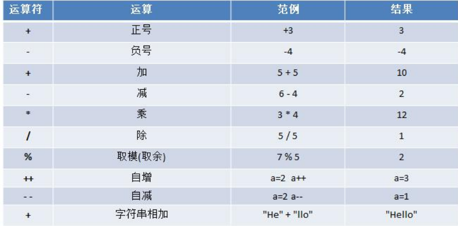

# 1. 运算符的介绍

运算符是一种特殊的符号，用以表示数据的运算、赋值和比较等 

运算符是一种特殊的符号，用以表示数据的运算、赋值和比较等

1) 算术运算符 

2) 赋值运算符 
3) 比较运算符/关系运算符 
4) 逻辑运算符
5) 位运算符 
6) 其它运算符

# 2. 算术运算符

算术运算符是对数值类型的变量进行运算的，比如：加减乘除。在 Go 程序中使用的非常多

## 2.1算术运算符的一览表



## 2.2 案例演示

**案例演示算术运算符的使用。**

+, - , * , / , %, ++, -- , 

重点讲解 /、% 

自增：++ 

自减：--

**演示 / 的使用的特点**

```go
func demo1() {
    fmt.Println(10 / 4) // 2

    var n1 float32 = 10 / 4
    fmt.Println(n1) // 2

    // 如果我们西王保留小水部分，则需要浮点数参与运算
    var n2 float32 = 10.0 / 4
    fmt.Println(n2) // 2.5
}
```