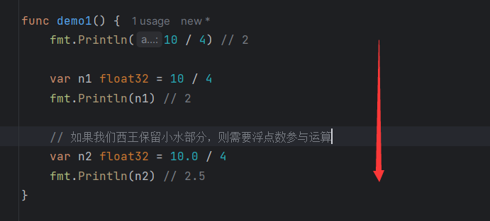
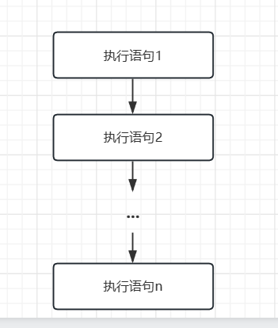
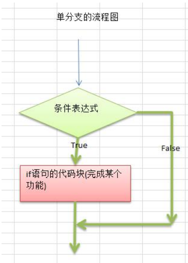
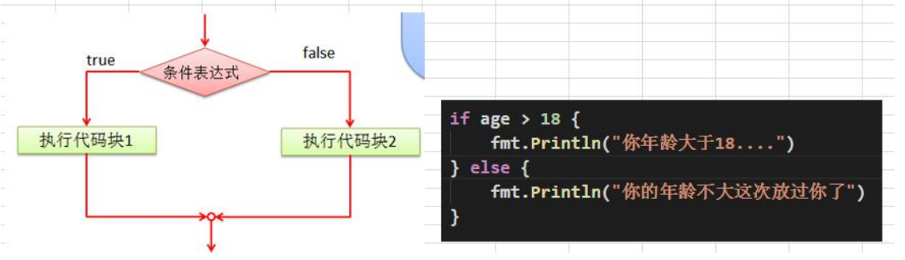
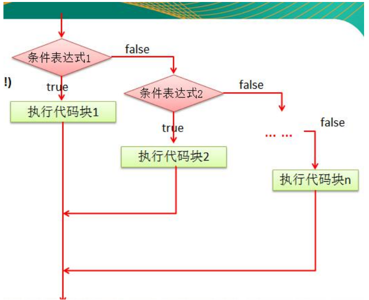
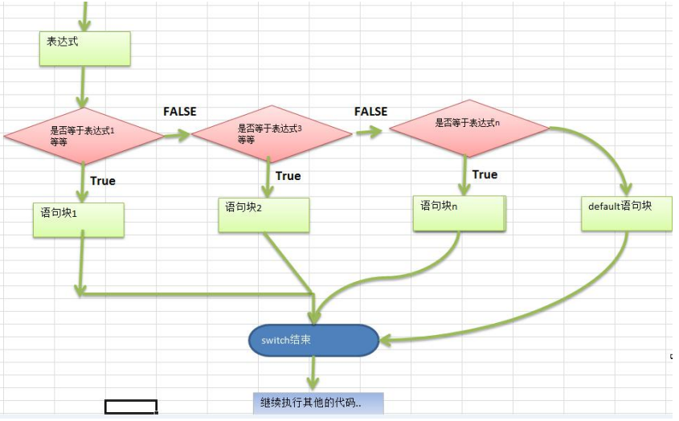
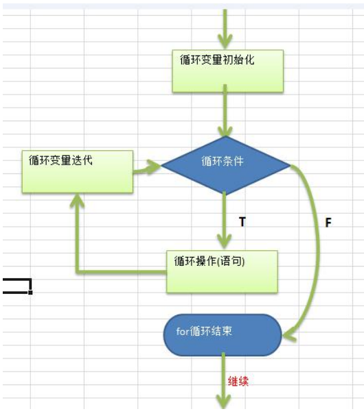

# 1. 程序流程控制介绍

在程序中，程序运行的流程控制决定程序是如何执行的，是我们必须掌握的，主要有三大流程控制语句。 

1) 顺序控制 
2) 分支控制 
3) 循环控制

# 2. 顺序控制

程序从上到下逐行地执行，中间没有任何判断和跳转。 

一个案例说明，必须下面的代码中，没有判断，也没有跳转.因此程序按照默认的流程执行，即顺序控制。



## 2.1 顺序控制的一个流程图



## 2.2 顺序控制举例和注意事项

```go
func mainDemo1() {
    var num1 int = 10        //声明了 num1
    var num2 int = num1 + 20 //使用 num1
    fmt.Println(num2)
}
```

num1 和 num2的定义顺序不能互换，因为num2中用到了num1

# 3. 分支控制

## 3.1 分支控制的基本介绍

分支控制就是让程序有选择执行。有下面三种形式

1) 单分支 
2) 双分支
3) 多分支

## 3.2 单分支控制

```go
if 条件表达式 {
   执行代码块
}
```

**说明：当条件表达式为true时，就会执行{}里面的代码**

**注意 {} 是必须有的，就算你只写一行代码**

应用案例 

请大家看个案例 [ifDemo.go]: 

>  编写一个程序,可以输入人的年龄,如果该同志的年龄大于 18 岁,
>
> 则输出"你年龄大于 18,要对自己的行为负责!" 
>
> 需求---[分析]---->代码 代码:

```go
func ifDemo1() {
    var age int
    fmt.Println("请输入年龄：")
    fmt.Scanln(&age)

    if age > 18 {
       fmt.Println("你的年龄大于18，要对自己的行为负责！")
    }
}
```

**单分支的流程图**

流程图可以用图形方式来更加清晰的描述程序执行的流程。



单分支的细节说明

```go
func ifDemo2() {
    if age := 20; age > 18 {
       fmt.Println("你的年龄大于18，要对自己的行为负责！")
    }
}
```

## 3.3 双分支控制

基本语法

```go
if 条件表达式 {
   执行代码块1
} else {
   执行代码块2
}
```

**说明：当条件表达式成立，即执行代码块1，否则执行代码块2. {} 也是必须有的。**

应用案例

请大家看个案例[IfDemo2.go]: 

> 编写一个程序,可以输入人的年龄,如果该同志的年龄大于 18 岁,
>
> 则输出“你年龄大于18,要对自己的行为负责!”。
>
> 否则 ,输出”你的年龄不大这次放过你了.”

```go
func ifDemo3() {
    var age = 19
    if age > 18 {
       fmt.Println("你的年龄大于18，要对自己的行为负责！")
    } else {
       fmt.Println("你的年龄不太大这次放过你了")
    }
}
```

双分支的流程图的分析



对双分支的总结

1. 从上图看 条件表达式就是 age >18 
2. 执行代码块 1 ===> fmt.Println("你的年龄大于 18") .. 
3. 执行代码块 2 ===> fmt.Println("你的年龄不大....") . 
4. 强调一下 双分支只会执行其中的一个分支。

## 3.4 单分支和双分支的案例

```go
func ifExp1() {
    var x int = 4
    var y int = 1
    if x > 2 {
       if y > 2 {
          fmt.Println(x + y)
       }
       fmt.Println("liufei")
    } else {
       fmt.Println("x is = ", x)
    }
}
```

输出的结果是liufei

## 3.5 多分支控制

基本语法

```go
if 条件表达式1 {
   执行代码块1
} else if 条件表达式2 {
   执行代码块2
}
...
else {
    执行代码块n
}
```

对上面基本语法的说明

**1) 多分支的判断流程如下:**

(1) 先判断条件表达式 1 是否成立，如果为真，就执行代码块 1

(2) 如果条件表达式 1 如果为假，就去判断条件表达式 2 是否成立，如果条件表达式2为真，就执行代码块 2 

(3) 依次类推. 

(4) 如果所有的条件表达式不成立，则执行 else 的语句块。

**2) else 不是必须的。**

**3) 多分支只能有一个执行入口。**

**看一个多分支的流程图(更加清晰)**



**多分支的快速入门案例**

> 岳小鹏参加 Golang 考试，他和父亲岳不群达成承诺： 如果： 成绩为 100 分时，奖励一辆 BMW； 
>
> 成绩为(80，99]时，奖励一台 iphone7plus； 
>
> 当成绩为[60,80]时，奖励一个 iPad； 
>
> 其它时，什么奖励也没有。
>
> 请从键盘输入岳小鹏的期末成绩，并加以判断

```go
func ifExp2() {
    var score int
    fmt.Println("请输入成绩：")
    fmt.Scanln(&score)

    // 多分支判断
    if score == 100 {
       fmt.Println("奖励一辆BMW")
    } else if score > 80 && score < 99 {
       fmt.Println("奖励一台iphone7plus")
    } else if score >= 60 && score <= 80 {
       fmt.Println("奖励一台 ipad")
    } else {
       fmt.Println("什么都不奖励")
    }
}
```

## 3.6 嵌套分支

**基本介绍**

在一个分支结构中又完整的嵌套了另一个完整的分支结构，里面的分支的结构称为内层分支外面的分支结构称为外层分支。

**基本语法**

```go
if 条件表达式 {
    if 条件表达式 {
        
    } else {
        
    }
}
```

**说明：嵌套分支不宜过多，建立控制在3层内**

**应用案例 1**

> 参加百米运动会，如果用时 8 秒以内进入决赛，否则提示淘汰。并且根据性别提示进入男子组或女子组。【可以让学员先练习下】, 输入成绩和性别。

```go
func ifExp3() {
    var second float32
    fmt.Println("请输入秒数：")
    fmt.Scanln(&second)

    if second <= 8 {
       // 进入决赛
       var gender string
       fmt.Println("请输入性别")
       fmt.Scanln(&gender)
       if gender == "男" {
          fmt.Println("进入决赛的男子组")
       } else {
          fmt.Println("进入决赛的女子组")
       }
    } else {
       fmt.Println("out...")
    }
}
```

# 4. switch 分支控制

## 4.1基本的介绍

1) switch 语句用于基于不同条件执行不同动作，每一个 case 分支都是唯一的，从上到下逐一测试，直到匹配为止。 

2) 匹配项后面也不需要再加 **break**

## 4.2 基本语法

```go
switch 表达式 {
	case 表达式1,表达式2，...:
    	语句块1
    case 表达式3,表达式4，...:
    // 这里可以有多个case语句
    default:
    	语句块
}
```

## 4.3 switch 的流程图



对上图的说明和总结

1) switch 的执行的流程是，先执行表达式，得到值，然后和 case 的表达式进行比较，如果相等，就匹配到，然后执行对应的 case 的语句块，然后退出 switch 控制。 

2) 如果 switch 的表达式的值没有和任何的 case 的表达式匹配成功，则执行default 的语句块。执行后退出 switch 的控制.
2) golang 的 case 后的表达式可以有多个，使用 逗号 间隔.
2) golang 中的 case 语句块不需要写 break , 因为默认会有，即在默认情况下，当程序执行完case语句块后，就直接退出该 switch 控制结构。

## 4.4 switch 快速入门案例

**案例：**

> 请编写一个程序，该程序可以接收一个字符，比如: a,b,c,d,e,f,g a表示星期一，b表示星期二…根据用户的输入显示相依的信息.要求使用 switch 语句完成

```go
func switchDemo1() {
    var key byte
    fmt.Println("请输入一个字符 a,b,c,d,e,f,g")
    fmt.Scanf("%c", &key)

    switch key {
    case 'a':
       fmt.Println("周一，猴子穿新衣")
    case 'b':
       fmt.Println("周二，猴子当小二")
    case 'c':
       fmt.Println("周三，猴子爬雪山")
    // ...
    default:
       fmt.Println("输入有误")

    }
}
```

## 4.5 switch 的使用的注意事项和细节

**1) case/switch 后是一个表达式( 即：常量值、变量、一个有返回值的函数等都可以)**

```go
func test(char byte) byte {
	return char
}

func switchDemo2() {
	var key byte
	fmt.Println("请输入一个字符 a,b,c,d,e,f,g")
	fmt.Scanf("%c", &key)

	switch test(key) {
	case 'a':
		fmt.Println("周一，猴子穿新衣")
	case 'b':
		fmt.Println("周二，猴子当小二")
	case 'c':
		fmt.Println("周三，猴子爬雪山")
	// ...
	default:
		fmt.Println("输入有误")

	}
}
```

**2) case 后的各个表达式的值的数据类型，必须和 switch 的表达式数据类型一致**

```go
func switchDemo3() {
    var n1 int32 = 20
    var n2 int64 = 20
    switch n1 {
    case n2: //错误，原因是 n2的数据类型和n1不一致
       fmt.Println("ok1")
    }
}
```

**3) case 后面可以带多个表达式，使用逗号间隔。比如 case 表达式 1, 表达式2 ...**

```go
func switchDemo4() {
    var n1 int32 = 5
    var n2 int32 = 20
    switch n1 {
    case n2, 10, 5: // case 后面可以有多个表达式
       fmt.Println("ok1")
    default:
       fmt.Println("没有匹配到")
    }
}
```

**4) case 后面的表达式如果是常量值(字面量)，则要求不能重复**

```go
func switchDemo5() {
    var n1 int32 = 5
    var n2 int32 = 20
    switch n1 {
    case n2, 10, 5: // case 后面可以有多个表达式
       fmt.Println("ok1")
    case 5: // 错误，因为前面我们有常量5，因此重复，就会报错
       fmt.Println("ok2~")
    default:
       fmt.Println("没有匹配到")
    }
}
```

**5) case 后面不需要带 break , 程序匹配到一个 case 后就会执行对应的代码块，然后退出switch，如果一个都匹配不到，则执行 default**

**6) default 语句不是必须的.**

**7) switch 后也可以不带表达式，类似 if --else 分支来使用。**

```go
// switch 后面也可以不带表达式
func switchDemo6() {
    var age = 10
    switch {
    case age == 10:
       fmt.Println("age == 10")
    case age == 20:
       fmt.Println("age == 20")
    default:
       fmt.Println("没有匹配到")
    }
}
```

**8) switch 后也可以直接声明/定义一个变量，分号结束，不推荐。 **

不推荐使用

```go
func switchDemo7() {
    switch grade := 90; {
    case grade > 90:
       fmt.Println("成绩优秀~..")
    case grade >= 70 && grade <= 90:
       fmt.Println("成绩优良~..")
    case grade >= 60 && grade < 70:
       fmt.Println("成绩优良~..")
    default:
       fmt.Println("不及格~")
    }
}
```

**9) switch 穿透-fallthrough ，如果在 case 语句块后增加 fallthrough ,则会继续执行下一个case，也叫 switch 穿透**

```go
func switchDemo8() {
    var num = 10
    switch num {
    case 10:
       fmt.Println("ok1")
       fallthrough // 默认只能穿透一层
    case 20:
       fmt.Println("ok2")
       fallthrough
    case 30:
       fmt.Println("ok3")
    default:
       fmt.Println("没有匹配到..")
    }
}
```

**10) Type Switch：switch 语句还可以被用于 type-switch 来判断某个interface 变量中实际指向的变量类型【还没有学 interface, 先体验一把】** 

```go
var x interface{}

func switchDemo9() {
    var y = 10.0
    x = y

    switch i := x.(type) {
    case nil:
       fmt.Println("x 的类型 ~: %T", i)
    case int:
       fmt.Println("x 是 int 型")
    case float64:
       fmt.Println("x 是 float64 型")
    case func(int) float64:
       fmt.Println("x 是 func(int) 型")
    case bool, string:
       fmt.Println("x 是 bool 或 string 型")
    default:
       fmt.Println("未知型")
    }
}
```

## 4.6 switch 的课堂练习

> 使用 switch 把小写类型的 char 型转为大写(键盘输入)。只转换a, b, c, d, e. 其它的输出“other”。

```go
func switchDemo10() {
    var char byte
    fmt.Println("请输入一个字符...")
    fmt.Scanf("%c", &char)

    switch char {
    case 'a':
       fmt.Println(strings.ToUpper("a"))
    case 'b':
       fmt.Println(strings.ToUpper("b"))
    case 'c':
       fmt.Println(strings.ToUpper("c"))
    case 'd':
       fmt.Println(strings.ToUpper("d"))
    case 'e':
       fmt.Println(strings.ToUpper("e"))
    default:
       fmt.Println("other")
    }
}
```

## 4.7 switch 和 if 的比较

总结了什么情况下使用 switch ,什么情况下使用 if

1) 如果判断的**具体数值不多**，而且符合整数、浮点数、字符、字符串这几种类型。建议使用swtich语句，简洁高效。
2) 其他情况：对区间判断和结果为 bool 类型的判断，使用 if，if 的使用范围更广。

# 5. for 循环控制

## 5.1基本介绍

听其名而知其意。就是让我们的一段代码循环的执行。

## 5.2 一个实际的需求

请大家看个案例

编写一个程序, 可以打印 10 句

"你好，GO语言！"。请大家想想怎么做?

```go
func forDemo1() {
    for i := 0; i < 10; i++ {
       fmt.Println("你好，GO语言！")
    }
}
```

## 5.3 for 循环的基本语法

**语法格式**

```go
for 循环变量初始化; 循环条件; 循环变量迭代 {
	循环操作(语句)
}
```

**对上面的语法格式说明**

1) 对 for 循环来说，有四个要素： 
2) 循环变量初始化 
3) 循环条件 
4) 循环操作(语句) ,有人也叫循环体。 
5) 循环变量迭代

**for 循环执行的顺序说明：**

1) 执行循环变量初始化，比如 i := 1 

2) 执行循环条件， 比如 i <= 10

3) 如果循环条件为真，就执行循环操作 ：比如 fmt.Println(“....”) 
4) 执行循环变量迭代 , 比如 i++ 
5) 反复执行 2, 3, 4 步骤，直到 循环条件为 False ，就退出 for 循环。

## 5.4 for 循环执行流程分析

for 循环的流程图



## 5.5 for 循环的使用注意事项和细节讨论

1. **循环条件**是返回一个**布尔值**的表达式

2. for 循环的第二种使用方式

   ```go
   for 循环判断条件 {
       // 循环执行语句
   }
   ```

   案例演示：

   ```go
   // for 循环的第二种看法
   func forDemo2() {
       j := 1
       for j <= 10 {
          fmt.Println("你好，GO语言-2")
          j++
       }
   }
   ```

   

3. for 循环的第三种使用方式

```go
for {
//循环执行语句
}
```

上面的写法等价 for ; ; {} 是一个无限循环， 通常需要配合 break 语句使用

```go
func forDemo3() {
    k := 1
    for {
       if k <= 10 {
          fmt.Println("ok!!")
       } else {
          break
       }
       k++
    }
}
```

4. Golang 提供 for-range 的方式，可以方便遍历字符串和数组

(注: 数组的遍历，我们放到讲数组的时候再讲解) ，**案例说明如何遍历字符串**。

**字符串遍历方式 1-传统方式**

```go
func forDemo4() {
    var str string = "hello,world!"
    for i := 0; i < len(str); i++ {
       fmt.Printf("%c \n", str[i])
    }
}
```

 **字符串遍历方式 2-for - range**

```go
func forDemo5() {
    fmt.Println()
    str := "abcdefg"
    for index, val := range str {
       fmt.Printf("index=%d, val=%c  \n", index, val)
    }
}
```

**上面代码的细节讨论**

如果我们的字符串含有中文，那么传统的遍历字符串方式，就是错误，会出现乱码。原因是传统的对字符串的遍历是按照字节来遍历，而一个汉字在 utf8 编码是对应 3 个字节。

如何解决 需要要将 str 转成 []rune 切片.=> 体验一把

```go
func forDemo6() {
    fmt.Println()
    str := "abcdefg杭州"
    str2 := []rune(str)
    for i := 0; i < len(str2); i++ {
       fmt.Printf("%c \n", str2[i])
    }
}
```

对应 for-range 遍历方式而言，是按照字符方式遍历。因此如果有字符串有中文，也是ok

```go
func forDemo5() {
    fmt.Println()
    str := "abcdefg杭州" // 这里中文是ok的，不会乱码
    for index, val := range str {
       fmt.Printf("index=%d, val=%c  \n", index, val)
    }
}
```

## 5.6 for 循环的课堂练习

> 打印 1~100 之间所有是 9 的倍数的整数的个数及总和

```go
func forDemo7() {
    var count = 0
    var sum = 0
    for i := 1; i <= 100; i++ {
       if i%9 == 0 {
          count++
          sum += i
       }
    }
    fmt.Printf("count=%v, sum=%v", count, sum)
}
```

输出结果：

count=11, sum=594

# 6 while 和 do..while 

//TODO