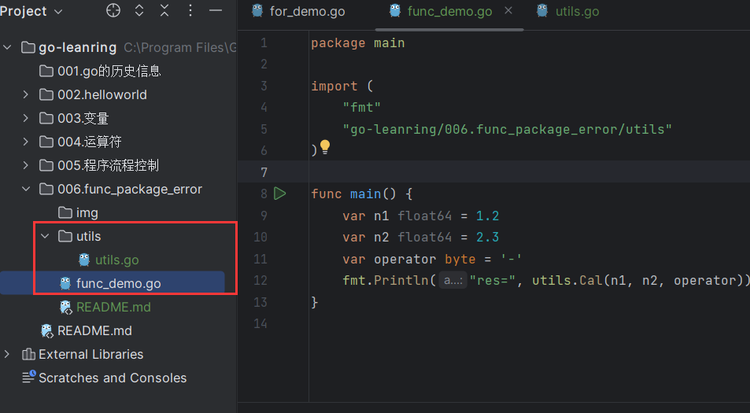
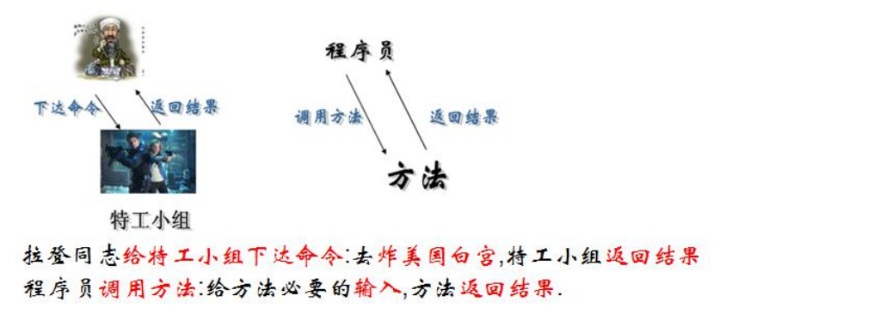
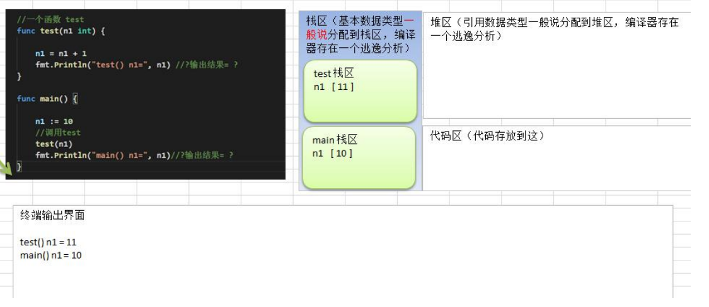
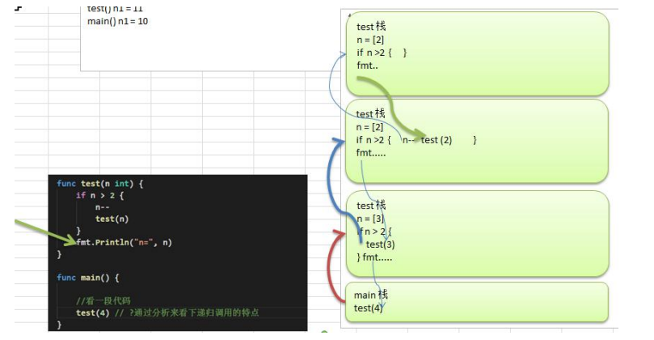
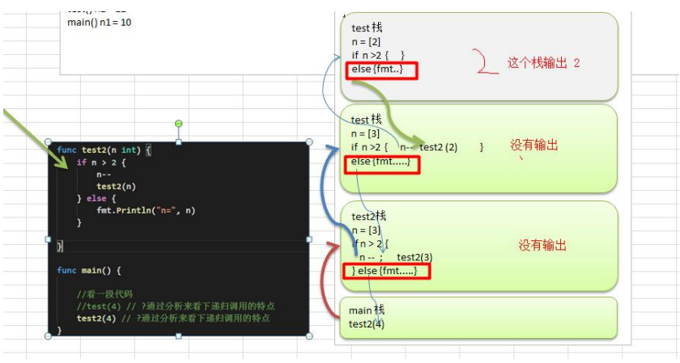

# 第六章：函数、包和错误处理

## 1. 为什么需要函数

### 1.1 请大家完成这样一个需求:

输入两个数,再输入一个运算符(+,-,*,/)，得到结果.。

### 1.2 使用传统的方法解决

走代码

```go
func main() {
    var n1 float64 = 1.2
    var n2 float64 = 2.3
    var operator byte = '-'
    var res float64
    switch operator {
    case '+':
       res = n1 + n2
    case '-':
       res = n1 - n2
    case '*':
       res = n1 * n2
    case '/':
       res = n1 / n2
    default:
       fmt.Printf("操作符号错误...")
    }
    fmt.Println("res=", res)
}
```

分析一下上面代码问题

1) 上面的写法是可以完成功能, 但是代码冗余 
2) 同时不利于代码维护 
3) 函数可以解决这个问题

## 2. 函数的基本概念

为完成某一功能的程序指令(语句)的集合,称为函数。 

在 Go 中,函数分为: 自定义函数、系统函数(查看 Go 编程手册)

## 3. 函数的基本语法

```go
func 函数名(形参列表)(返回值列表) {
	执行语句...
	return 返回值列表
}
```

1 形参列表：表示函数的输入

2 函数中的语句：表示为了实现某一功能代码块

3 函数可以有返回值，也可以没有

## 4. 快速入门案例

使用函数解决前面的计算问题。 

走代码:

```go
func cal(n1 float64, n2 float64, operator byte) float64 {
	var res float64
	switch operator {
	case '+':
		res = n1 + n2
	case '-':
		res = n1 - n2
	case '*':
		res = n1 * n2
	case '/':
		res = n1 / n2
	default:
		fmt.Printf("操作符号错误...")
	}
	return res
}
```

调用函数

```go
func main() {
    var n1 float64 = 1.2
    var n2 float64 = 2.3
    var operator byte = '-'
    fmt.Println("res=", cal(n1, n2, operator))
}
```

## 5. 包的引出

在实际的开发中，我们往往需要在不同的文件中，去调用其它文件的定义的函数，比如main.go中，去使用 utils.go 文件中的函数，如何实现？ -》包

现在有两个程序员共同开发一个 Go 项目，程序员 xiaoming 希望定义函数Cal ，程序员xiaoqiang也想定义函数也叫 Cal。两个程序员为此还吵了起来,怎么办? -》包

## 6. 包的原理图

包的本质实际上就是创建不同的文件夹，来存放程序文件。

## 7. 包的基本概念

说明：go 的每一个文件都是属于一个包的，也就是说 go 是以包的形式来管理文件和项目目录结构的

## 8. 包的三大作用

区分相同名字的函数、变量等标识符

当程序文件很多时,可以很好的管理项目 

控制函数、变量等访问范围，即作用域

## 9. 包的相关说明

### 打包基本语法

```go
package 包名
```

### 引入包的基本语法

```go
import "包的路径"
```

## 10. 包使用的快速入门

包快速入门-Go 相互调用函数，我们将 func Cal 定义到文件 utils.go , 将utils.go 放到一个包中，当其它文件需要使用到 utils.go 的方法时，可以 import 该包，就可以使用了. 

【为演示：新建项目目录结构】



utils.go 文件

```go
package utils

import "fmt"

func Cal(n1 float64, n2 float64, operator byte) float64 {
    var res float64
    switch operator {
    case '+':
       res = n1 + n2
    case '-':
       res = n1 - n2
    case '*':
       res = n1 * n2
    case '/':
       res = n1 / n2
    default:
       fmt.Printf("操作符号错误...")
    }
    return res
}
```

func_demo.go  文件

```go
package main

import (
    "fmt"
    "go-leanring/006.func_package_error/utils"
)

func main() {
    var n1 float64 = 1.2
    var n2 float64 = 2.3
    var operator byte = '-'
    fmt.Println("res=", utils.Cal(n1, n2, operator))
}
```

注意：

1. 整个go-leanring 工程需要放到GO安装目录下的src目录下，不然包引用无效
2. 包名称不能包含中文，所以这一章目录使用英文名

## 11. 包使用的注意事项和细节讨论

1) 在给一个文件打包时，该包对应一个文件夹，比如这里的 utils 文件夹对应的包名就是utils，文件的包名通常和文件所在的文件夹名一致，一般为小写字母。 

2) 当一个文件要使用其它包函数或变量时，需要先引入对应的包

   引入方式 1：import "包名"

   引入方式 2：

   ```go
   import ( "包名"
   	"包名"
   )
   ```

   package 指令在 文件第一行，然后是 import 指令。

   在 import 包时，路径从 $GOPATH 的 src 下开始，不用带 src , 编译器会自动从src 下开始引入

3. 为了让其它包的文件，可以访问到本包的函数，则该函数名的**首字母**需要大写，类似其它语言的 public ,这样才能跨包访问。比如 `utils.go` 的Cal函数
4. 在访问其它包函数，变量时，其语法是 包名.函数名， 比如这里的 `func_demo.go`文件中

5. 如果包名较长，Go 支持给包取别名， 注意细节：取别名后，原来的包名就不能使用了

   ```go
   import (
   	"fmt"
   	util "go-leanring/006.func_package_error/utils"
   )
   
   func main() {
   	var n1 float64 = 1.2
   	var n2 float64 = 2.3
   	var operator byte = '-'
       // 这里使用别名 util 调用
   	fmt.Println("res=", util.Cal(n1, n2, operator))
   }
   ```

   说明: 如果给包取了别名，则需要使用别名来访问该包的函数和变量

6) 在同一包下，不能有相同的函数名（也不能有相同的全局变量名），否则报重复定义
7) 如果你要编译成一个可执行程序文件，就需要将这个包声明为 main , 即package main.这个就是一个语法规范，如果你是写一个库 ，包名可以自定义

## 12. 函数的调用机制

### 12.1 通俗易懂的方式的理解



### 12.2 函数-调用过程

**传入一个数+1**



对上图说明

(1) 在调用一个函数时，会给该函数分配一个新的空间，编译器会通过自身的处理让这个新的空间和其它的栈的空间区分开来

(2) 在每个函数对应的栈中，数据空间是独立的，不会混淆

(3) 当一个函数调用完毕(执行完毕)后，程序会销毁这个函数对应的栈空间。

**计算两个数,并返回**

```go
package main

import (
	"fmt"
	util "go-leanring/006.func_package_error/utils"
)

func main() {
    var n1 float64 = 1.2
    var n2 float64 = 2.3
    var operator byte = '-'
    fmt.Println("res=", util.Cal(n1, n2, operator))

    n3 := 10
    test(n3)

    fmt.Println("main() n1=", n1) // ? 输出结果=?

    sum := getSum(10, 20)
    fmt.Println("main sum = ", sum)
}

func test(n1 int) {
    n1 = n1 + 1
    fmt.Println("test() n1 = ", n1) // 输出结果
}

func getSum(n1 int, n2 int) int {
    sum := n1 + n2
    fmt.Println("getSum() sum = ", sum)
    return sum
}
```

### 12.3 return 语句

**基本语法和说明**

go函数支持返回多个值，这一点是其它编程语言没有的

```go
func 函数名 (形参列表) (返回值类型列表) {
	语句...
    return 返回值列表
}
```

（1）如果返回多个值时，在接收时，希望忽略某个返回值，则使用_符号表示占位忽略

（2）如果返回值只有一个，（返回值类型列表）可以不写 ()

**案例演示 1**

请编写要给函数，可以计算两个数的和和差，并返回结果

```go
func main() {
	// 调用getSumAndSub
	res1, res2 := getSumAndSub(1, 2)
	fmt.Printf("sum=%v, sub=%v", res1, res2)
}

func getSumAndSub(n1 int, n2 int) (int, int) {
    sum := n1 + n2
    sub := n1 - n2
    return sum, sub
}
```

**案例演示 2**

一个细节说明: 希望忽略某个返回值，则使用 _ 符号表示占位忽略

```go
func main() {
	// 调用getSumAndSub
	_, res3 := getSumAndSub(1, 2)
	fmt.Println("res3=", res3)
}
```

## 13 函数的递归调用

### 13.1 基本介绍

一个函数在**函数体内**又**调用了本身**，我们称为递归调用

### 13.2 递归调用快速入门

```go
package main

import (
    "fmt"
)

func main() {
    test(4)
}

// 介绍递归
func test(n int) {
    if n > 2 {
       n--
       test(n)
    }
    fmt.Println("n=", n)
}
```

上面代码的分析图:



输出结果

```go
n= 2
n= 2
n= 3
```

**代码 2**

```go
func test2(n int) {
    if n > 2 {
       n--
       test2(n)
    } else {
       fmt.Println("n=", n)
    }
}
```

输出结果

```go
n= 2
```

对上面代码分析的示意图：



### 13.3 递归调用的总结

**函数递归需要遵守的重要原则:**

1) 执行一个函数时，就创建一个新的受保护的独立空间(新函数栈) 
2) 函数的局部变量是独立的，不会相互影响 
3) 递归必须向退出递归的条件逼近，否则就是无限递归，死龟了:) 
4) 当一个函数执行完毕，或者遇到 return，就会返回，遵守谁调用，就将结果返回给谁，同时当函数执行完毕或者返回时，该函数本身也会被系统销毁

### 13.4 递归课堂练习题

#### 题 1：斐波那契数

> 请使用递归的方式，求出斐波那契数 1,1,2,3,5,8,13... 
>
> 给你一个整数 n，求出它的斐波那契数是多少？

思路: 

1) 当 n == 1 || n ==2 , 返回 1 

2) 当 n >= 2, 返回 前面两个数的和 f(n-1) + f(n-2)

```go
func fbn(n int) int {
    if n == 1 || n == 2 {
       return 1
    }
    return fbn(n-1) + fbn(n-2)
}
```

#### 题 2：求函数值

已知 f(1)=3; f(n) = 2 * f(n-1) + 1

请使用递归的思想编程，求出 f(n)的值?

**思路:**

直接使用给出的表达式即可完成

```go
func f(n int) int {
    if n == 1 {
       return 3
    }
    return 2*f(n-1) + 1
}
```

#### 题 3：猴子吃桃子问题

> 有一堆桃子，猴子第一天吃了其中的一半，并再多吃了一个！以后每天猴子都吃其中的一半，然后再多吃一个。
>
> 当到第十天时，想再吃时（还没吃），发现只有 1 个桃子了。
>
> 问题：最初共多少个桃子？

**思路分析：** 

1) 第 10 天只有一个桃子 
1) 第 9 天有几个桃子 = (第 10 天桃子数量 + 1) * 2 
1) 规律: 第 n 天的桃子数据 peach(n) = (peach(n+1) + 1) * 2

**代码:**

```go
func peach(n int) int {
    if n > 10 || n < 1 {
       fmt.Println("你输入的天数不对!!")
       return 0
    }
    if n == 10 {
       return 1
    }
    return (peach(n+1) + 1) * 2
}

func main() {
	// 测试
	res2 := peach(1)
	fmt.Println("第1天桃子的数量=", res2) // 1534
}
```

## 14. 函数使用的注意事项和细节讨论

1. 函数的形参列表可以是多个，返回值列表也可以是多个。 

2) 形参列表和返回值列表的数据类型可以是值类型和引用类型。 
3)  函数的命名遵循标识符命名规范，首字母不能是数字，首字母大写该函数可以被本包文件和其它包文件使用，类似 public , 首字母小写，只能被本包文件使用，其它包文件不能使用，类似private

4) 函数中的变量是局部的，函数外不生效【案例说明】

5) 基本数据类型和数组默认都是值传递的，即进行值拷贝。在函数内修改，不会影响到原来的值。

   ```go
   func main() {
   	// n的值不会改变
   	n := 10
   	test3(n)
   	fmt.Println("main() n=", n)
   }
   
   func test3(n int) {
   	n = n + 10
   	fmt.Println("test3 n=", n)
   }
   ```

   输出：

   ```go
   test3 n= 20
   main() n= 10
   ```

6) 如果希望函数内的变量能修改函数外的变量(指的是默认以值传递的方式的数据类型)，可以传入变量的地址&，函数内以指针的方式操作变量。从效果上看类似引用 。

   ```go
   func main() {
       // 可以传入变量地址
   	num := 20
   	test4(&num)
   	fmt.Println("main() num=", num)
   }
   
   func test4(n *int) {
   	*n = *n + 20
   	fmt.Println("test4 n=", *n) // 如果直接打印n，打印的是变量地址
   }
   ```

   输出

   ```go
   test4 n= 40
   main() num= 40 
   ```

   7. Go 函数不支持函数重载
   7. 在 Go 中，**函数也是一种数据类型**，可以赋值给一个变量，则该变量就是一个函数类型的变量了。通过该变量可以对函数调用

   ```go
   func main() {
       a := getSum
       fmt.Printf("a的类型%T,getSum类型时%T\n", a, getSum)
       result := a(10, 20)
       fmt.Println("result=", result)
   }
   
   func getSum(n1 int, n2 int) int {
   	return n1 + n2
   }
   ```

   输出

   ```go
   a的类型func(int, int) int,getSum类型时func(int, int) int
   result= 30
   ```

   9. 函数既然是一种数据类型，因此在 Go 中，函数可以作为形参，并且调用
   10. 为了简化数据类型定义，Go 支持自定义数据类型