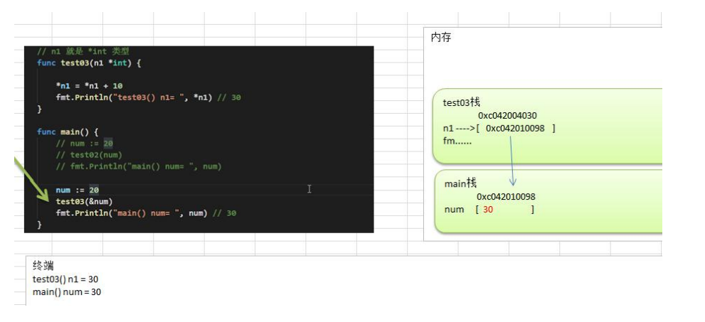

# 第六章：函数、包和错误处理

## 1. 为什么需要函数

### 1.1 请大家完成这样一个需求:

输入两个数,再输入一个运算符(+,-,*,/)，得到结果.。

### 1.2 使用传统的方法解决

走代码

```go
func main() {
    var n1 float64 = 1.2
    var n2 float64 = 2.3
    var operator byte = '-'
    var res float64
    switch operator {
    case '+':
       res = n1 + n2
    case '-':
       res = n1 - n2
    case '*':
       res = n1 * n2
    case '/':
       res = n1 / n2
    default:
       fmt.Printf("操作符号错误...")
    }
    fmt.Println("res=", res)
}
```

分析一下上面代码问题

1) 上面的写法是可以完成功能, 但是代码冗余 
2) 同时不利于代码维护 
3) 函数可以解决这个问题

## 2. 函数的基本概念

为完成某一功能的程序指令(语句)的集合,称为函数。 

在 Go 中,函数分为: 自定义函数、系统函数(查看 Go 编程手册)

## 3. 函数的基本语法

```go
func 函数名(形参列表)(返回值列表) {
	执行语句...
	return 返回值列表
}
```

1 形参列表：表示函数的输入

2 函数中的语句：表示为了实现某一功能代码块

3 函数可以有返回值，也可以没有

## 4. 快速入门案例

使用函数解决前面的计算问题。 

走代码:

```go
func cal(n1 float64, n2 float64, operator byte) float64 {
	var res float64
	switch operator {
	case '+':
		res = n1 + n2
	case '-':
		res = n1 - n2
	case '*':
		res = n1 * n2
	case '/':
		res = n1 / n2
	default:
		fmt.Printf("操作符号错误...")
	}
	return res
}
```

调用函数

```go
func main() {
    var n1 float64 = 1.2
    var n2 float64 = 2.3
    var operator byte = '-'
    fmt.Println("res=", cal(n1, n2, operator))
}
```

## 5. 包的引出

在实际的开发中，我们往往需要在不同的文件中，去调用其它文件的定义的函数，比如main.go中，去使用 utils.go 文件中的函数，如何实现？ -》包

现在有两个程序员共同开发一个 Go 项目，程序员 xiaoming 希望定义函数Cal ，程序员xiaoqiang也想定义函数也叫 Cal。两个程序员为此还吵了起来,怎么办? -》包

## 6. 包的原理图

包的本质实际上就是创建不同的文件夹，来存放程序文件。

## 7. 包的基本概念

说明：go 的每一个文件都是属于一个包的，也就是说 go 是以包的形式来管理文件和项目目录结构的

## 8. 包的三大作用

区分相同名字的函数、变量等标识符

当程序文件很多时,可以很好的管理项目 

控制函数、变量等访问范围，即作用域

## 9. 包的相关说明

### 打包基本语法

```go
package 包名
```

### 引入包的基本语法

```go
import "包的路径"
```

## 10. 包使用的快速入门

包快速入门-Go 相互调用函数，我们将 func Cal 定义到文件 utils.go , 将utils.go 放到一个包中，当其它文件需要使用到 utils.go 的方法时，可以 import 该包，就可以使用了. 

【为演示：新建项目目录结构】


utils.go 文件

```go
package utils

import "fmt"

func Cal(n1 float64, n2 float64, operator byte) float64 {
    var res float64
    switch operator {
    case '+':
       res = n1 + n2
    case '-':
       res = n1 - n2
    case '*':
       res = n1 * n2
    case '/':
       res = n1 / n2
    default:
       fmt.Printf("操作符号错误...")
    }
    return res
}
```

func_demo.go  文件

```go
package main

import (
    "fmt"
    "go-leanring/006.func_package_error/utils"
)

func main() {
    var n1 float64 = 1.2
    var n2 float64 = 2.3
    var operator byte = '-'
    fmt.Println("res=", utils.Cal(n1, n2, operator))
}
```

注意：

1. 整个go-leanring 工程需要放到GO安装目录下的src目录下，不然包引用无效
2. 包名称不能包含中文，所以这一章目录使用英文名

## 11. 包使用的注意事项和细节讨论

1) 在给一个文件打包时，该包对应一个文件夹，比如这里的 utils 文件夹对应的包名就是utils，文件的包名通常和文件所在的文件夹名一致，一般为小写字母。 

2) 当一个文件要使用其它包函数或变量时，需要先引入对应的包

   引入方式 1：import "包名"

   引入方式 2：

   ```go
   import ( "包名"
   	"包名"
   )
   ```

   package 指令在 文件第一行，然后是 import 指令。

   在 import 包时，路径从 $GOPATH 的 src 下开始，不用带 src , 编译器会自动从src 下开始引入

3. 为了让其它包的文件，可以访问到本包的函数，则该函数名的**首字母**需要大写，类似其它语言的 public ,这样才能跨包访问。比如 `utils.go` 的Cal函数
4. 在访问其它包函数，变量时，其语法是 包名.函数名， 比如这里的 `func_demo.go`文件中

5. 如果包名较长，Go 支持给包取别名， 注意细节：取别名后，原来的包名就不能使用了

   ```go
   import (
   	"fmt"
   	util "go-leanring/006.func_package_error/utils"
   )
   
   func main() {
   	var n1 float64 = 1.2
   	var n2 float64 = 2.3
   	var operator byte = '-'
       // 这里使用别名 util 调用
   	fmt.Println("res=", util.Cal(n1, n2, operator))
   }
   ```

   说明: 如果给包取了别名，则需要使用别名来访问该包的函数和变量

6) 在同一包下，不能有相同的函数名（也不能有相同的全局变量名），否则报重复定义
7) 如果你要编译成一个可执行程序文件，就需要将这个包声明为 main , 即package main.这个就是一个语法规范，如果你是写一个库 ，包名可以自定义

## 12. 函数的调用机制

### 12.1 通俗易懂的方式的理解


### 12.2 函数-调用过程

**传入一个数+1**


对上图说明

(1) 在调用一个函数时，会给该函数分配一个新的空间，编译器会通过自身的处理让这个新的空间和其它的栈的空间区分开来

(2) 在每个函数对应的栈中，数据空间是独立的，不会混淆

(3) 当一个函数调用完毕(执行完毕)后，程序会销毁这个函数对应的栈空间。

**计算两个数,并返回**

```go
package main

import (
	"fmt"
	util "go-leanring/006.func_package_error/utils"
)

func main() {
    var n1 float64 = 1.2
    var n2 float64 = 2.3
    var operator byte = '-'
    fmt.Println("res=", util.Cal(n1, n2, operator))

    n3 := 10
    test(n3)

    fmt.Println("main() n1=", n1) // ? 输出结果=?

    sum := getSum(10, 20)
    fmt.Println("main sum = ", sum)
}

func test(n1 int) {
    n1 = n1 + 1
    fmt.Println("test() n1 = ", n1) // 输出结果
}

func getSum(n1 int, n2 int) int {
    sum := n1 + n2
    fmt.Println("getSum() sum = ", sum)
    return sum
}
```

### 12.3 return 语句

**基本语法和说明**

go函数支持返回多个值，这一点是其它编程语言没有的

```go
func 函数名 (形参列表) (返回值类型列表) {
	语句...
    return 返回值列表
}
```

（1）如果返回多个值时，在接收时，希望忽略某个返回值，则使用_符号表示占位忽略

（2）如果返回值只有一个，（返回值类型列表）可以不写 ()

**案例演示 1**

请编写要给函数，可以计算两个数的和和差，并返回结果

```go
func main() {
	// 调用getSumAndSub
	res1, res2 := getSumAndSub(1, 2)
	fmt.Printf("sum=%v, sub=%v", res1, res2)
}

func getSumAndSub(n1 int, n2 int) (int, int) {
    sum := n1 + n2
    sub := n1 - n2
    return sum, sub
}
```

**案例演示 2**

一个细节说明: 希望忽略某个返回值，则使用 _ 符号表示占位忽略

```go
func main() {
	// 调用getSumAndSub
	_, res3 := getSumAndSub(1, 2)
	fmt.Println("res3=", res3)
}
```

## 13. 函数的递归调用

### 13.1 基本介绍

一个函数在**函数体内**又**调用了本身**，我们称为递归调用

### 13.2 递归调用快速入门

```go
package main

import (
    "fmt"
)

func main() {
    test(4)
}

// 介绍递归
func test(n int) {
    if n > 2 {
       n--
       test(n)
    }
    fmt.Println("n=", n)
}
```

上面代码的分析图:


输出结果

```go
n= 2
n= 2
n= 3
```

**代码 2**

```go
func test2(n int) {
    if n > 2 {
       n--
       test2(n)
    } else {
       fmt.Println("n=", n)
    }
}
```

输出结果

```go
n= 2
```

对上面代码分析的示意图：


### 13.3 递归调用的总结

**函数递归需要遵守的重要原则:**

1) 执行一个函数时，就创建一个新的受保护的独立空间(新函数栈) 
2) 函数的局部变量是独立的，不会相互影响 
3) 递归必须向退出递归的条件逼近，否则就是无限递归，死龟了:) 
4) 当一个函数执行完毕，或者遇到 return，就会返回，遵守谁调用，就将结果返回给谁，同时当函数执行完毕或者返回时，该函数本身也会被系统销毁

### 13.4 递归课堂练习题

#### 题 1：斐波那契数

> 请使用递归的方式，求出斐波那契数 1,1,2,3,5,8,13... 
>
> 给你一个整数 n，求出它的斐波那契数是多少？

思路: 

1) 当 n == 1 || n ==2 , 返回 1 

2) 当 n >= 2, 返回 前面两个数的和 f(n-1) + f(n-2)

```go
func fbn(n int) int {
    if n == 1 || n == 2 {
       return 1
    }
    return fbn(n-1) + fbn(n-2)
}
```

#### 题 2：求函数值

已知 f(1)=3; f(n) = 2 * f(n-1) + 1

请使用递归的思想编程，求出 f(n)的值?

**思路:**

直接使用给出的表达式即可完成

```go
func f(n int) int {
    if n == 1 {
       return 3
    }
    return 2*f(n-1) + 1
}
```

#### 题 3：猴子吃桃子问题

> 有一堆桃子，猴子第一天吃了其中的一半，并再多吃了一个！以后每天猴子都吃其中的一半，然后再多吃一个。
>
> 当到第十天时，想再吃时（还没吃），发现只有 1 个桃子了。
>
> 问题：最初共多少个桃子？

**思路分析：** 

1) 第 10 天只有一个桃子 
1) 第 9 天有几个桃子 = (第 10 天桃子数量 + 1) * 2 
1) 规律: 第 n 天的桃子数据 peach(n) = (peach(n+1) + 1) * 2

**代码:**

```go
func peach(n int) int {
    if n > 10 || n < 1 {
       fmt.Println("你输入的天数不对!!")
       return 0
    }
    if n == 10 {
       return 1
    }
    return (peach(n+1) + 1) * 2
}

func main() {
	// 测试
	res2 := peach(1)
	fmt.Println("第1天桃子的数量=", res2) // 1534
}
```

## 14. 函数使用的注意事项和细节讨论

1. 函数的形参列表可以是多个，返回值列表也可以是多个。 

2. 形参列表和返回值列表的数据类型可以是值类型和引用类型。 

3)  函数的命名遵循标识符命名规范，首字母不能是数字，首字母大写该函数可以被本包文件和其它包文件使用，类似 public , 首字母小写，只能被本包文件使用，其它包文件不能使用，类似private

4) 函数中的变量是局部的，函数外不生效【案例说明】

5) 基本数据类型和数组默认都是值传递的，即进行值拷贝。在函数内修改，不会影响到原来的值。

   ```go
   func main() {
   	// n的值不会改变
   	n := 10
   	test3(n)
   	fmt.Println("main() n=", n)
   }
   
   func test3(n int) {
   	n = n + 10
   	fmt.Println("test3 n=", n)
   }
   ```

   输出：

   ```go
   test3 n= 20
   main() n= 10
   ```

6) 如果希望函数内的变量能修改函数外的变量(指的是默认以值传递的方式的数据类型)，可以传入变量的地址&，函数内以指针的方式操作变量。从效果上看类似引用 。

   ```go
   func main() {
       // 可以传入变量地址
   	num := 20
   	test4(&num)
   	fmt.Println("main() num=", num)
   }
   
   func test4(n *int) {
   	*n = *n + 20
   	fmt.Println("test4 n=", *n) // 如果直接打印n，打印的是变量地址
   }
   ```

   输出

   ```go
   test4 n= 40
   main() num= 40 
   ```

   7. Go 函数不支持函数重载
   7. 在 Go 中，**函数也是一种数据类型**，可以赋值给一个变量，则该变量就是一个函数类型的变量了。通过该变量可以对函数调用

   ```go
   func main() {
       a := getSum
       fmt.Printf("a的类型%T,getSum类型时%T\n", a, getSum)
       result := a(10, 20)
       fmt.Println("result=", result)
   }
   
   func getSum(n1 int, n2 int) int {
   	return n1 + n2
   }
   ```

   输出

   ```go
   a的类型func(int, int) int,getSum类型时func(int, int) int
   result= 30
   ```

   9. 函数既然是一种数据类型，因此在 Go 中，函数可以作为形参，并且调用
   
   10. 为了简化数据类型定义，Go 支持自定义数据类型
   
       基本语法：type 自定义数据类型名 数据类型 // 理解: 相当于一个别名
   
       案例：type myInt int // 这时 myInt 就等价 int 来使用了.
   
       案例：type mySum func (int, int) int // 这时 mySum 就等价一个函数类型func (int, int)int
   
       ```go
       type myInt int
       
       var num1 myInt
       var num2 int
       num1 = 40
       num2 = int(num1) // 这里依然需要显示转换，go认为myInt和int是两个类型
       fmt.Println("num1=", num1, "num2=", num2)
       ```
   
       ```go
       // 这时 myFun 就是 func(int, int) int 类型
       type MyFuncType func(int, int) int
       
       // 函数既然是一种数据类型，因此在Go中，函数可以作为形参，并且调用
       func myFunc2(funcVar MyFuncType, num1 int, num2 int) int {
       	return funcVar(num1, num2)
       }
       ```
   
       11. 支持对函数返回值命名
   
       12. 使用 _ 标识符，忽略返回值
   
       13. Go 支持可变参数
   
           ```go
           // 支持0到多个参数
           func sum1(args ...int) int {
           	res := 0
           	for i := range args {
           		res += args[i]
           	}
           	return res
           }
           
           // 支持1到多个参数
           func sum2(n1 int, args ...int) int {
           	res := n1
           	for i := range args {
           		res += args[i]
           	}
           	return res
           }
           ```
   
           说明：
   
           (1) **args 是 slice 切片，通过args[index] 可以访问到各个值**
   
           (2) 案例演示：编写一个函数sum，可以求出1 到 多个 int 的和
   
           (3) 如果一个函数的形参列表中有可变参数，则可变参数需要放在形参列表的最后（跟Java一样）
   
           ```go
           func sum(n1 int, args ...int) int {
           	sum := n1
           	for i := 0; i < len(args); i++ {
           		sum += args[i]
           	}
           	return sum
           }
           ```
   
           
   

## 15. 函数的课堂练习

略

## 16. init 函数 (init_demo.go)

### 16.1 基本介绍

每一个源文件都可以包含一个 init 函数，该函数会在 main 函数执行前，被Go 运行框架调用，也就是说 init 会在 main 函数前被调用。

### 16.2 案例说明：

```go
package main

import "fmt"

func init() {
	fmt.Println("init()...")
}

func main() {
	fmt.Println("main()...")
}
```

**输出结果：**

```go
init()...
main()...
```

### 16.3 inti 函数的注意事项和细节

\1) 如果一个文件同时包含全局变量定义，init 函数和 main 函数，则执行的流程**全局变量定义->init函数->main 函数**

```go
package main

import "fmt"

var age = init_test()

func init() {
    fmt.Println("init()...")
}

func main() {
    fmt.Println("main()...")
}

func init_test() int {
    fmt.Println("init_test()") // i
    return 90
}
```

输出结果：

```go
init_test()
init()...
main()...
```

\2) init 函数最主要的作用，就是完成一些初始化的工作，比如下面的案例

```go
package utils

import "fmt"

var Age int
var Name string

func init() {
    fmt.Println("utils 包的 init()...")
    Age = 100
    Name = "tom..."
}
```

\3) 细节说明: 

**面试题：案例如果 main.go 和 utils.go 都含有 变量定义，init 函数时，执行的流程又是怎么样的呢？**

```go
package main

import (
    "fmt"
    "go-leanring/006.func_package_error/utils"
)

var age = init_test()

func init() {
    fmt.Println("init()...")
}

func main() {
    fmt.Println("main()...")
    fmt.Println("Age=", utils.Age, "Name=", utils.Name)
}

func init_test() int {
    fmt.Println("init_test()") // i
    return 90
}
```

输出结果：

```go
utils 包的 init()...
init_test()
init()...
main()...
Age= 100 Name= tom...
```


## 17. 匿名函数 (anon_demo.go)

### 17.1 介绍

Go 支持匿名函数，匿名函数就是没有名字的函数，如果我们某个函数只是希望使用一次，可以考虑使用匿名函数，匿名函数也可以实现多次调用。

### 17.2 匿名函数使用方式 1

在定义匿名函数时就直接调用，这种方式匿名函数只能调用一次。 

【案例演示】

```go
package main

import "fmt"

func main() {
    // 在定义匿名函数时就直接调用，这种方式明明函数只能调用一次

    res1 := func(n1 int, n2 int) int {
       return n1 + n2
    }(10, 20)

    fmt.Println("res1=", res1)
}
```

### 17.3 匿名函数使用方式 2

将匿名函数赋给一个变量(函数变量)，再通过该变量来调用匿名函数【案例演示】

```go
a := func(n1 int, n2 int) int {
    return n1 + n2
}
res2 := a(10, 30)
fmt.Println("res2=", res2)
res3 := a(90, 30)
fmt.Println("res3=", res3)
```

### 17.4 全局匿名函数

如果将匿名函数赋给一个全局变量，那么这个匿名函数，就成为一个全局匿名函数，可以在程序有效。

```go
var (
    Func1 = func(n1 int, n2 int) int {
       return n1 * n2
    }
)

func main() {
	res4 := Func1(4, 9)
	fmt.Println("res4=", res4)  // 36
}
```

## 18. 闭包(close_package_demo.go)

### 18.1 介绍

基本介绍：闭包就是**一个函数**和与**其相关的引用环境**组合的**一个整体**(实体)

### 18.2 案例演示：

```go
package main

import "fmt"

func main() {
    f := AddUpper()
    fmt.Println(f(1)) // 11
    fmt.Println(f(2)) // 13
    fmt.Println(f(3)) // 16
}

// 累加器
func AddUpper() func(int) int {
    var n int = 10
    return func(i int) int {
       n = n + i
       return n
    }
}
```

**对上面代码的说明和总结**

\1) AddUpper 是一个函数，返回的数据类型是 fun (int) int

\2) 闭包的说明

```go
var n int = 10
return func(i int) int {
    n = n + i
    return n
}
```

返回的是一个匿名函数, 但是这个匿名函数引用到函数外的 n ,因此这个匿名函数就和n形成一个整体，构成闭包。

\3) 大家可以这样理解: 闭包是类, 函数是操作，n 是字段。函数和它使用到n 构成闭包。

\4) 当我们反复的调用 f 函数时，因为 n 是初始化一次，因此每调用一次就进行累计。5) 我们要搞清楚闭包的关键，就是要分析出返回的函数它使用(引用)到哪些变量，因为函数和它引用到的变量共同构成闭包。

\6) 对上面代码的一个修改，加深对闭包的理解

```go
// 累加器
func AddUpper() func(int) int {
    var n int = 10
    var str = "hello"
    return func(i int) int {
       n = n + i
       str += string(36) // 36 => $
       fmt.Println("str=", str)
       return n
    }
}
```

输出结果：

```go
str= hello$
11
str= hello$$
13
str= hello$$$
16
```

### 18.3 闭包的最佳实践

> 请编写一个程序，具体要求如下：
>
> \1) 编写一个函数 makeSuffix(suffix string) 可以接收一个文件后缀名(比如.jpg)，并返回一个闭包
>
> \2) 调用闭包，可以传入一个文件名，如果该文件名没有指定的后缀(比如.jpg) ,则返回文件名.jpg, 如果已经有.jpg 后缀，则返回原文件名。
>
> \3) 要求使用闭包的方式完成 
>
> \4) strings.HasSuffix , 该函数可以判断某个字符串是否有指定的后缀。

```go
func makeSuffix(suffix string) func(string) string {
    return func(file string) string {
       if !strings.HasSuffix(file, ".jpg") {
          file = file + ".jpg"
       }
       return file
    }
}

func main() {
	// 测试makeSuffix 的使用
	// 返回一个闭包

	f2 := makeSuffix(".jpg")
	fmt.Println("文件名处理后=", f2("winter"))
	fmt.Println("文件名处理后=", f2("bird.jpg"))
}
```

输出：

```go
文件名处理后= winter.jpg
文件名处理后= bird.jpg
```

**上面代码的总结和说明:**

\1) 返回的匿名函数和 makeSuffix (suffix string) 的 suffix 变量 组合成一个闭包,因为返回的函数引用到 suffix 这个变量 

\2) 我们体会一下闭包的好处，如果使用传统的方法，也可以轻松实现这个功能，但是传统方法需要每次都传入 后缀名，比如 .jpg ,而闭包因为可以保留上次引用的某个值，所以我们传入一次就可以反复使用。大家可以仔细的体会一把！

## 19. 函数的 defer (defer_demo.go)

### 19.1 为什么需要 defer

在函数中，程序员经常需要创建资源(比如：数据库连接、文件句柄、锁等) ，为了在**函数执行完毕后，及时的释放资源**，Go 的设计者提供 **defer** (延时机制)。

### 19.2 快速入门案例

```go
package main

import "fmt"

func main() {
    res := deferSum(10, 20)
    fmt.Println("res=", res)
}

func deferSum(n1 int, n2 int) int {
    // 当执行到defer时，暂时不执行，会将defer后面的语句压入到独立的栈（defer栈）
    // 当函数执行完毕后，再从defer栈，按照先入后出的方式出栈，执行
    defer fmt.Println("ok1 n1=", n1)
    defer fmt.Println("ok2 n2=", n2)

    res := n1 + n2
    fmt.Println("ok3 res=", res)
    return res
}
```

输出结果：

```go
ok3 res= 30
ok2 n2= 20
ok1 n1= 10
res= 30
```

### 19.3 defer 的注意事项和细节

\1) 当 go 执行到一个 defer 时，不会立即执行 defer 后的语句，而是将defer 后的语句压入到一个栈中【我为了讲课方便，暂时称该栈为 defer 栈】， 然后继续执行函数下一个语句。

\2) 当函数执行完毕后，在从 defer 栈中，依次从栈顶取出语句执行(注：遵守栈先入后出的机制)，所以看到前面案例输出的顺序。

\3) 在 defer 将语句放入到栈时，也会将相关的值拷贝同时入栈。请看一段代码：

```go
func deferSum(n1 int, n2 int) int {
    // 当执行到defer时，暂时不执行，会将defer后面的语句压入到独立的栈（defer栈）
    // 当函数执行完毕后，再从defer栈，按照先入后出的方式出栈，执行
    defer fmt.Println("ok1 n1=", n1)
    defer fmt.Println("ok2 n2=", n2)

    // 增加一句话
    n1++
    n2++

    res := n1 + n2
    fmt.Println("ok3 res=", res)
    return res
}
```

输出结果：

```go
ok3 res= 32
ok2 n2= 20
ok1 n1= 10
res= 32
```

### 19.4 defer 的最佳实践

defer 最主要的价值是在，当函数执行完毕后，可以及时的释放函数创建的资源。看下模拟代码。

```go
func testFile(filename string) {
    // 关闭文件资源
    file, _ := os.Open(filename)
    defer file.Close()
    // 其它代码
}

func test() {
    // 释放数据库资源
    connect = openDatabase()
    defer connect.close()
}
```

说明

\1) 在 golang 编程中的通常做法是，创建资源后，比如(打开了文件，获取了数据库的链接，或者是锁资源)， 可以执行 defer file.Close() defer connect.Close()

\2) 在 defer 后，可以继续使用创建资源.

\3) 当函数完毕后，系统会依次从 defer 栈中，取出语句，关闭资源.

\4) 这种机制，非常简洁，程序员不用再为在什么时机关闭资源而烦心。

## 20. 函数参数传递方式

### 20.1 基本介绍

我们在讲解函数注意事项和使用细节时，已经讲过值类型和引用类型了，这里我们再系统总结一下，因为这是重难点，值类型参数默认就是值传递，而引用类型参数默认就是引用传递。

### 20.2 两种传递方式

\1) 值传递

\2) 引用传递

其实，不管是值传递还是引用传递，传递给函数的都是变量的副本，不同的是，值传递的是值的拷贝，引用传递的是地址的拷贝，一般来说，地址拷贝效率高，因为数据量小，而值拷贝决定拷贝的数据大小，数据越大，效率越低。

### 20.3 值类型和引用类型

\1) **值类型**：基本数据类型 int 系列, float 系列, bool, string 、数组和结构体struct

\2) **引用类型**：指针、slice 切片、map、管道 chan、interface 等都是引用类型

### 20.4 值传递和引用传递使用特点

1. 值类型默认是值传递：变量直接存储值，内存通常在栈中分配

   

2. 引用类型默认是引用传递：变量存储的是一个地址，这个地址对应的空间菜真正存储数据值，内存通常在堆上分配，当没有任何变量引用这个地址时，该地址对应的数据空间就成为一个垃圾，由GC来回收

   

3) 如果希望函数内的变量能修改函数外的变量，可以传入变量的地址&，函数内以指针的方式操作变量。从效果上看类似引用 。这个案例在前面详解函数使用注意事项的



## 21. 变量作用域 (scope_demo.go)

\1) 函数内部声明/定义的变量叫局部变量，**作用域仅限于函数内**部

```go
func scopeDemo() {
    // age 和 Name的作用域只在test函数内部
    age := 10
    Name := "tom..."
    fmt.Println("age=", age, "Name=", Name)
}
```

\2) 函数外部声明/定义的变量叫全局变量，作用域在整个包都有效，如果其首字母为大写，则作用域在整个程序有效

\3) 如果变量是在一个代码块，比如 for / if 中，那么这个变量的的作用域就在该代码块

### 21.1 变量作用域的课堂练习

```go
var name = "tom" // 全局变量

func test01() {
    fmt.Println(name) // tom
}

func test02() { // 编译器采用就近原则
    name := "jack"
    fmt.Println(name) // jack
}

func main() {
    fmt.Println(name)

    test01() // tom
    test02() // jack
    test01() // tom
}
```

输出的结果是: tom tom jack tom

```go
Name := "tom" // 不能直接这样定义全局变量，等价与 var Name string  Name = "tom"  赋值语句不能再函数体外，所以这里错
```

## 22. 函数课堂练习(综合)（practice_demo.go）

\1) 函数可以没有返回值案例，编写一个函数,从终端输入一个整数打印出对应的金子塔

**分析思路**：就是将原来写的打印金字塔的案例，使用函数的方式封装，在需要打印时，直接调用即可。

```go
// 打印金字塔的代码封装到函数中
func printPyramid(totalLevel int) {
    for i := 1; i <= totalLevel; i++ {
       for k := 1; k <= totalLevel-i; k++ {
          fmt.Print(" ")
       }

       // j 表示每层打印多少*
       for j := 1; j <= 2*i-1; j++ {
          fmt.Print("*")
       }

       fmt.Println()
    }
}

func main() {
	printPyramid(8)
}
```

输出结果：

```go
       *
      ***
     *****
    *******
   *********
  ***********
 *************
***************
```

\2) 编写一个函数,从终端输入一个整数(1—9),打印出对应的乘法表

```go
func printMulti(num int) {
    // 打印出九九乘法表
    for i := 1; i <= num; i++ {
       for j := 1; j <= i; j++ {
          fmt.Printf("%v * %v = %v \t", j, i, i*j)
       }
       fmt.Println()
    }
}

func main() {
	printMulti(8)
}
```

输出结果：

```go
1 * 1 = 1 
1 * 2 = 2       2 * 2 = 4 
1 * 3 = 3       2 * 3 = 6       3 * 3 = 9 
1 * 4 = 4       2 * 4 = 8       3 * 4 = 12      4 * 4 = 16
1 * 5 = 5       2 * 5 = 10      3 * 5 = 15      4 * 5 = 20      5 * 5 = 25
1 * 6 = 6       2 * 6 = 12      3 * 6 = 18      4 * 6 = 24      5 * 6 = 30      6 * 6 = 36
1 * 7 = 7       2 * 7 = 14      3 * 7 = 21      4 * 7 = 28      5 * 7 = 35      6 * 7 = 42      7 * 7 = 49
1 * 8 = 8       2 * 8 = 16      3 * 8 = 24      4 * 8 = 32      5 * 8 = 40      6 * 8 = 48      7 * 8 = 56      8 * 8 = 64
```

\3) 编写函数,对给定的一个二维数组(3×3)转置，这个题讲数组的时候再完成


## 23. 字符串常用的系统函数 (string_func_demo.go)

说明：字符串在我们程序开发中，使用的是非常多的，常用的函数需要同学们掌握【带看手册或者官方编程指南】:

### 1) 统计字符串的长度，按字节 len(str)

```go
func main() {
    // go统一编码时utf-8，utf-8中汉字占用三个字节
    fmt.Println(stringLen("hello北")) // 8
}

func stringLen(str string) int {
    return len(str)
}
```

### 2) 字符串遍历

同时处理有中文的问题 r := []rune(str)

```go
func stringDemo1(str string) {
    r := []rune(str)
    for i := 0; i < len(r); i++ {
       fmt.Printf("字符=%c \n", r[i])
    }
}
```

输出：

```go
字符=h 
字符=e 
字符=l 
字符=l 
字符=o 
字符=北 
```

### 3) 字符串转整数:

```go
// 字符串转整数: n, err := strconv.Atoi("12")
func stringDemo2(str string) {
    n, err := strconv.Atoi(str)
    if err != nil {
       fmt.Println("类型转换错误", err)
    } else {
       fmt.Println("转成的结果是", n)
    }
}
```

### 4) 整数转字符串

```go
// 整数转字符串 str = strconv.Itoa(12345)
func stringDemo3(num int) {
    str := strconv.Itoa(num)
    fmt.Printf("str=%v, str=%T", str, str)
}
```

### 5) 字符串 转 []byte

```go
// 字符串 转 []byte: var bytes = []byte("hello go")
func stringDemo4(str string) {
    var bytes = []byte(str)
    fmt.Printf("bytes=%v\n", bytes)
}
```

### 6) []byte 转 字符串

```go
// []byte 转 字符串: str = string([]byte{97, 98, 99})
func stringDemo5(bytes []byte) {
    str := string(bytes)
    fmt.Println("[]byte转字符串结果:", str)
}
```

### 7) 10 进制转 2, 8, 16

```go
// 10 进制转 2, 8, 16 进制: str = strconv.FormatInt(123, 2) // 2-> 8 , 16
func stringDemo6() {
    var str string
    str = strconv.FormatInt(123, 2)
    fmt.Printf("123对应的二进制是=%v\n", str)
    str = strconv.FormatInt(123, 16)
    fmt.Printf("123对应的16进制是=%v\n", str)
}
```

### 8) 查找子串是否在指定的字符串中

```go
// 查找子串是否在指定的字符串中: strings.Contains("seafood", "foo") //true
func stringDemo7() {
    b := strings.Contains("seafood", "foo")
    fmt.Printf("b=%v", b)
}
```

### 9) 统计一个字符串有几个指定的子串

```go
// 统计一个字符串有几个指定的子串 ： strings.Count("ceheese", "e") //4
func stringDemo8() {
    num := strings.Count("ceheese", "e")
    fmt.Printf("num=%v", num)
}
```

### 10) 不区分大小写的字符串比较(==是区分字母大小写的)

```go
// 不区分大小写的字符串比较(==是区分字母大小写的): fmt.Println(strings.EqualFold("abc", "Abc")) // true
func stringDemo9() {
    b := strings.EqualFold("abc", "Abc")
    fmt.Printf("b=%v", b)
}
```

### 11) 返回子串在字符串第一次出现的 index 值，

```go
// 返回子串在字符串第一次出现的 index 值，如果没有返回-1 : strings.Index("NLT_abc", "abc") // 4
func stringDemo10() {
    index := strings.Index("NLT_abc", "abc")
    fmt.Printf("index=%v \n", index)
}
```

### 12) 返回子串在字符串最后一次出现的 index

```go
// 返回子串在字符串最后一次出现的 index，如没有返回-1 : strings.LastIndex("go golang", "go")
func stringDemo11() {
    index := strings.LastIndex("go golang", "go")
    fmt.Printf("LastIndex=%v \n", index) // 3
}
```

### 13) 将指定的子串替换成 另外一个子串

```go
// 将指定的子串替换成 另外一个子串: strings.Replace("go go hello", "go", "go 语言", n) n可以指定你希望替换几个，如果 n=-1 表示全部替换
func stringDemo12() {
    str2 := "go go hello"
    str := strings.Replace(str2, "go", "go 语言", -1)
    fmt.Printf("str=%v str2=%v \n", str, str2)
}
```

### 14) 按照指定的某个字符, 为分割标识 

```go
// 按 照 指 定 的 某 个 字 符 ， 为 分 割 标 识 ， 将 一 个 字 符 串拆分成字符串数组：strings.Split("hello,wrold,ok", ",")
func stringDemo13() {
    strArr := strings.Split("hello,world,ok", ",")
    for i := 0; i < len(strArr); i++ {
       fmt.Printf("str[%v]=%v \n", i, strArr[i])
    }
    fmt.Printf("strArr=%v \n", strArr)
}
```

### 16) 将字符串左右两边的空格去掉

```go
// 将字符串左右两边的空格去掉： strings.TrimSpace(" tn a lone gopher ntrn ")
func stringDemo14() {
    str := strings.TrimSpace(" tn a lone gopher ntrn ")
    fmt.Printf("str=%v \n", str)
}
```

### 17) 将字符串左右两边指定的字符去掉 

```go
// 将字符串左右两边指定的字符去掉 ： strings.Trim("! hello! ", " !") // ["hello"] //将左右两边!和 " "去掉
func stringDemo15() {
    str := strings.Trim("! hello! ", " !")
    fmt.Printf("str=%v \n", str)
}
```

### 18) 将字符串左边指定的字符去掉

```go
// 将字符串左边指定的字符去掉 ： strings.TrimLeft("! hello! ", " !") // ["hello"] //将左边! 和""去掉
func stringDemo16() {
    str := strings.TrimLeft("! hello! ", " !")
    fmt.Printf("str=%v \n", str)
}
```

### 19) 将字符串右边指定的字符去掉

```go
// 将字符串右边指定的字符去掉 ：strings.TrimRight("! hello! ", " !") // ["hello"] //将右边! 和""去掉
func stringDemo17() {
    str := strings.TrimRight("! hello! ", " !")
    fmt.Printf("str=%v \n", str)
}
```

### 20) 判断字符串是否以指定的字符串开头

```go
// 判断字符串是否以指定的字符串开头: strings.HasPrefix("ftp://192.168.10.1", "ftp") // true
func stringDemo18() {
    flag := strings.HasPrefix("ftp://192.168.10.1", "ftp")
    fmt.Printf("flag=%v \n", flag)
}
```

### 21) 判断字符串是否以指定的字符串结束

```go
// 判断字符串是否以指定的字符串结束: strings.HasSuffix("NLT_abc.jpg", "abc") //false
func stringDemo19() {
    flag := strings.HasSuffix("abc.jpg", "abc")
    fmt.Printf("flag=%v \n", flag)
}
```

## 24. 时间和日期相关函数

### 24.1 基本的介绍

说明：在编程中，程序员会经常使用到日期相关的函数，比如：统计某段代码执行花费的时间等等。

\1) 时间和日期相关函数，需要导入 time 包


\2) time.Time 类型，用于表示时间

```go
func main() {
    // 1. 获取当前时间
    now := time.Now()
    fmt.Printf("now=%v now type=%T", now, now)
}
```

输出：

```go
now=2023-10-06 10:18:50.1583538 +0800 CST m=+0.002033201 now type=time.Time
```

\3) 如何获取到其它的日期信息

```go
func main() {
    // 1. 获取当前时间
    now := time.Now()
    fmt.Printf("now=%v now type=%T \n", now, now)

    // 2. 通过now可以获取到年月日，时分秒
    fmt.Printf("年=%v\n", now.Year())
    fmt.Printf("月=%v\n", now.Month())
    fmt.Printf("月=%v\n", int(now.Month()))
    fmt.Printf("日=%v\n", now.Day())
    fmt.Printf("时=%v\n", now.Hour())
    fmt.Printf("分=%v\n", now.Minute())
    fmt.Printf("秒=%v\n", now.Second())
}
```

\4) 格式化日期时间

**方式 1: 就是使用 Printf 或者 SPrintf**

```go
fmt.Printf("当前年月日 %d-%d-%d %d:%d:%d\n", now.Year(), now.Month(), now.Day(), now.Hour(), now.Minute(), now.Second())
dataStr := fmt.Sprintf("当前年月日 %d-%d-%d %d:%d:%d\n", now.Year(), now.Month(), now.Day(), now.Hour(), now.Minute(), now.Second())
fmt.Printf("dataStr=%v\n", dataStr)
```

**方式二: 使用 time.Format() 方法完成:**

```go
// 3.1 使用date.Format()
fmt.Printf(now.Format("2006-01-02 15:04:05")) // 这里面的每个数字都是固定的
fmt.Println()
fmt.Printf(now.Format("2006-01-02"))
fmt.Println()
fmt.Printf(now.Format("15:04:05"))
fmt.Println()
```

对上面代码的说明: 

"2006/01/02 15:04:05" 这个字符串的各个数字是固定的，必须是这样写。

"2006/01/02 15:04:05" 这个字符串各个数字可以自由的组合，这样可以按程序需求来返回时间和日期

\5) 时间的常量

```go
const (
    Nanosecond  Duration = 1   // 纳秒
    Microsecond          = 1000 * Nanosecond   // 微妙
    Millisecond          = 1000 * Microsecond  // 毫秒
    Second               = 1000 * Millisecond  // 秒
    Minute               = 60 * Second         // 分钟
    Hour                 = 60 * Minute         // 小时
)
```

常量的作用：

**在程序中可用于获取指定时间单位的时间，比如想得到100 毫秒 ** 100 * time. Millisecond

\6) 结合 Sleep 来使用一下时间常量

```go
func timeDemo() {
    // 需求：每隔1秒打印出一个数字，打印到100就退出
    // 需求2：每隔0.1秒打印出一个数字，打印到100就退出
    for i := 1; i <= 100; i++ {
       // time.Sleep(1 * time.Second) // 1 秒
       time.Sleep(100 * time.Millisecond) // 0.1 秒
       fmt.Println(i)
    }
}
```

\7) time 的 Unix 和 UnixNano 的方法


```go
fmt.Printf("unix时间戳=%v unixnano时间戳=%v\n", now.Unix(), now.UnixNano())
```

结果是：

```go
unix时间戳=1696560605 unixnano时间戳=1696560605074310200
```

### 24.2 时间和日期的课堂练习

编写一段代码来统计 函数 test03 执行的时间

```go
package main

import (
	"fmt"
	"strconv"
	"time"
)

func test03() {
	str := ""
	for i := 0; i < 100000; i++ {
		str += "hello" + strconv.Itoa(i)
	}
}
func main() {
    start := time.Now().Unix()
    test03()
    end := time.Now().Unix()
    fmt.Printf("执行test03()耗费时间为%v秒\n", end-start)
}
```

## 25. 内置函数

### 25.1 说明：

Golang 设计者为了编程方便，提供了一些函数，这些函数可以直接使用，我们称为Go 的内置函数。文档：https://studygolang.com/pkgdoc -> builtin

\1) len：用来求长度，比如 string、array、slice、map、channel

\2) new：用来分配内存，主要用来分配值类型，比如 int、float32,struct...返回的是指针举例说明 new 的使用：

\3) make：用来分配内存，主要用来分配引用类型，比如 

## 26. 错误处理 (exception_demo.go)

### 26.1 看一段代码，因此错误处理

```go
package main

import "fmt"

func main() {
    exceptionTest()
    fmt.Println("main()下面的代码...")
}

func exceptionTest() {
    num1 := 10
    num2 := 0
    res := num1 / num2
    fmt.Println("res=", res)
}
```

对上面代码的总结

1) 在默认情况下，当发生错误后(panic) ,程序就会退出（崩溃.） 

2) 如果我们希望：当发生错误后，可以捕获到错误，并进行处理，保证程序可以继续执行。还可以在捕获到错误后，给管理员一个提示(邮件,短信。。。） 
3) 这里引出我们要将的错误处理机制

### 26.2 基本说明

\1) Go 语言追求简洁优雅，所以，Go 语言不支持传统的 try…catch…finally 这种处理。

\2) Go 中引入的处理方式为：**defer, panic, recover**

\3) 这几个异常的使用场景可以这么简单描述：Go 中可以抛出一个 panic 的异常，然后在defer 中通过 recover 捕获这个异常，然后正常处理

### 26.3 使用 defer+recover 

```go
package main

import "fmt"

func main() {
    exceptionTest()
    fmt.Println("main()下面的代码...")
}

func exceptionTest() {
    // 使用 defer + recover 来捕获和处理异常
    defer func() {
       err := recover() // recober() 内置函数，可以捕获异常
       if err != nil {  // 说明捕获到异常
          fmt.Println("err=", err)
       }
    }()
    num1 := 10
    num2 := 0
    res := num1 / num2
    fmt.Println("res=", res)
}
```

### 26.4 错误处理的好处

进行错误处理后，程序不会轻易挂掉，如果加入预警代码，就可以让程序更加的健壮。看一个

案例演示：

```go
func exceptionTest() {
    // 使用 defer + recover 来捕获和处理异常
    defer func() {
       err := recover() // recober() 内置函数，可以捕获异常
       if err != nil {  // 说明捕获到异常
          // 这里可以将错误信息发送给管理员...
          //fmt.Println("err=", err)
          fmt.Println("发送又叫给admin@sohu.com")
       }
    }()
    num1 := 10
    num2 := 0
    res := num1 / num2
    fmt.Println("res=", res)
}
```

### 26.5 自定义错误

### 26.6 自定义错误的介绍

Go 程序中，也支持自定义错误， 使用 errors.New 和 panic 内置函数。

1) errors.New("错误说明") , 会返回一个 error 类型的值，表示一个错误

2) panic 内置函数 ,接收一个 interface{} 类型的值（也就是任何值了）作为参数。
3) 可以接收error 类型的变量，输出错误信息，并退出程序.

### 26.7 案例说明

```go
func readConf(name string) (err error) {
    if name == "config.ini" {
       // 读取
       return nil
    } else {
       // 返回一个自定义错误
       return errors.New("读取文件错误...")
    }
}

func readConf2() {
    err := readConf("config2.ini")
    if err != nil {
       // 如果读取文件发送错误，就输出这个错误，并终止程序
       panic(err)
    }
    fmt.Println("readConf2()继续执行")
}
```