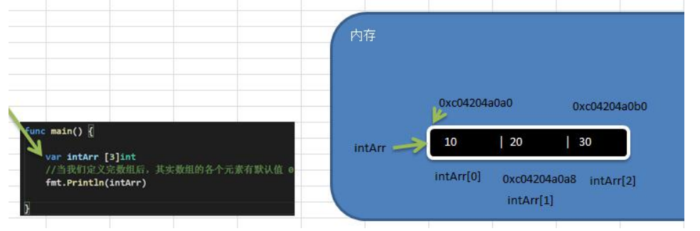
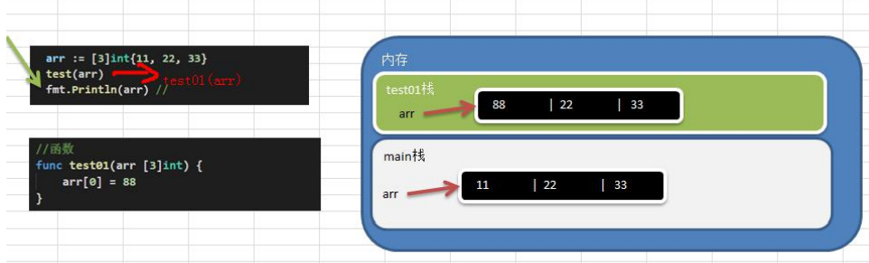
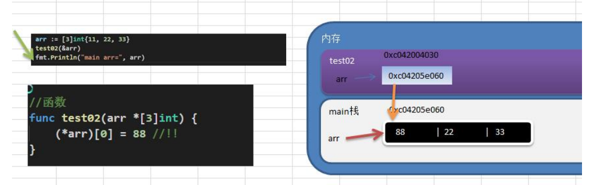
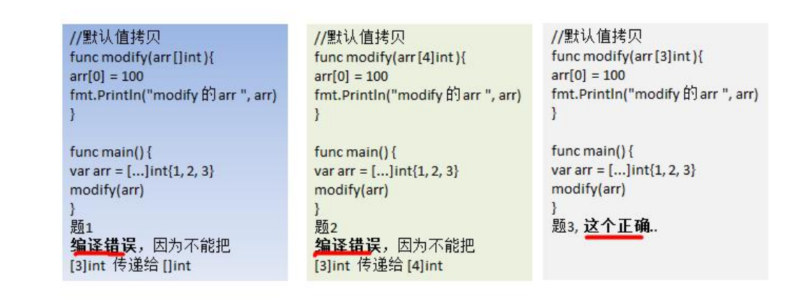
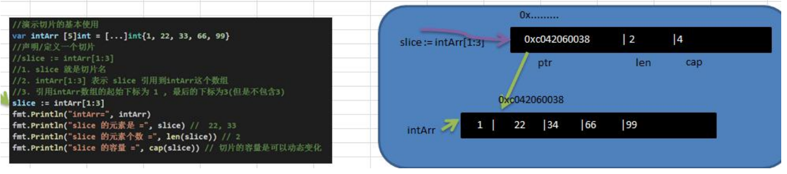
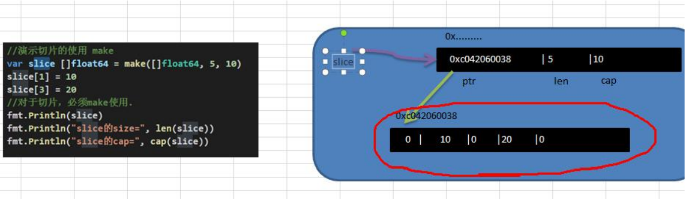
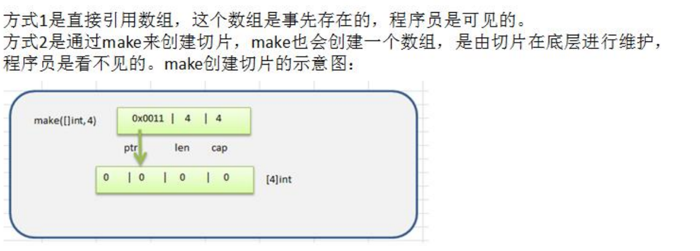

# 第7章数组与切片

## 7.1 为什么需要数组

看一个问题

> 一个养鸡场有 6 只鸡，它们的体重分别是 3kg,5kg,1kg,3.4kg,2kg,50kg 。
>
> 请问这六只鸡的总体重是多少?
>
> 平均体重是多少? 
>
> 请你编一个程序。=》数组

使用传统的方法来解决

```go
func demo() {
    // 定义六个变量，分别代表六只鸡，然后求出和，然后求出平均值
    hen1 := 3.0
    hen2 := 5.0
    hen3 := 1.0
    hen4 := 3.4
    hen5 := 2.0
    hen6 := 50.0

    totalWeight := hen1 + hen2 + hen3 + hen4 + hen5 + hen6
    // 保留小数点2位
    avgWeight := fmt.Sprintf("%.2f", totalWeight/6)

    fmt.Printf("totalWeight=%v avgWeight=%v", totalWeight, avgWeight)
}
```

对上面代码的说明 

1) 使用传统的方法不利于数据的管理和维护. 
2) 传统的方法不够灵活，因此我们引出需要学习的新的数据类型=>数组

## 7.2 数组介绍

数组可以存放多个同一类型数据。数组也是一种数据类型，在 Go 中，数组是值类型。

## 7.3 数组的快速入门

我们使用数组的方法来解决养鸡场的问题.

```go
func demo2() {
    // 定义六个变量，分别代表六只鸡，然后求出和，然后求出平均值
    var hens [7]float64
    hens[0] = 3.0
    hens[1] = 5.0
    hens[2] = 1.0
    hens[3] = 3.4
    hens[4] = 2.0
    hens[5] = 50.0
    hens[6] = 150.0 // 增加一只鸡

    totalWeight := 0.0
    for i := 0; i < len(hens); i++ {
       totalWeight += hens[i]
    }

    // 保留小数点2位
    avgWeight := fmt.Sprintf("%.2f", totalWeight/float64(len(hens)))
    fmt.Printf("totalWeight=%v avgWeight=%v", totalWeight, avgWeight)
}
```

对上面代码的总结 

1) 使用数组来解决问题，程序的可维护性增加. 
2) 而且方法代码更加清晰，也容易扩展。

## 7.4 数组定义和内存布局

**数组的定义**

var 数组名 [数组大小]数据类型 

var a [5]int 

赋初值 a[0] = 1 a[1] = 30 ....

**数组在内存布局(重要)**



对上图的总结: 

1) 数组的地址可以通过数组名来获取 &intArr 
2) 数组的第一个元素的地址，就是数组的首地址 
3) 数组的各个元素的地址间隔是依据数组的类型决定，比如 int64 -> 8 int32->4...

```go
var intArr [3]int
// 当我们定义完数组后，其实数组的各个元素有默认值，默认是0
fmt.Println(intArr)
intArr[0] = 10
intArr[1] = 20
intArr[2] = 30
fmt.Println(intArr)
fmt.Printf("intArr的地址=%p intArr[0]的地址=%p, intArr[1] 地址=%p, intArr[2]地址=%p \n", &intArr, &intArr[0], &intArr[1], &intArr[2])
```

输出结果：

```go
[0 0 0]
[10 20 30]
intArr的地址=0xc00000a120 intArr[0]的地址=0xc00000a120, intArr[1] 地址=0xc00000a128, intArr[2]地址=0xc00000a130 
```

## 7.5 数组的使用

### **访问数组元素**

**数组名[下标]** 比如：你要使用 a 数组的第三个元素 a[2]

### **快速入门案例**

从终端循环输入 5 个成绩，保存到 float64 数组,并输出.

```go
func demo4() {
    // 从终端循环输入5个成绩，保存到float64数组，并输出
    var score [5]float64

    for i := 0; i < len(score); i++ {
       fmt.Printf("请输入第%d个元素的值\n", i+1)
       fmt.Scanln(&score[i])
    }

    // 变量打印
    for i := 0; i < len(score); i++ {
       fmt.Printf("score[%d]=%v\n", i, score[i])
    }
}
```

### 四种初始化数组的方式

```go
func demo5() {
    // 四种初始化数组的方式
    var numArr01 [3]int = [3]int{1, 2, 3}
    fmt.Println("numArr01=", numArr01)

    var numArr02 = [3]int{5, 6, 7}
    fmt.Println("numArr02=", numArr02)

    // 这里的[...] 是规定的写法
    var numArr03 = [...]int{8, 9, 10}
    fmt.Println("numArr03=", numArr03)

    var numArr04 = [...]int{1: 800, 0: 900, 2: 999}
    fmt.Println("numArr04=", numArr04)

    // 类型推导
    strArr05 := [...]string{1: "tom", 0: "jack", 2: "mary"}
    fmt.Println("strArr05=", strArr05)
}
```

## 7.6 数组的遍历

### 7.6.1方式 1-常规遍历:

前面已经讲过了，不再赘述。

### 7.6.2方式 2-for-range 结构遍历

这是 Go 语言一种独有的结构，可以用来遍历访问数组的元素。

**for--range 的基本语法**

```go
for index, value := range array01 {
 ...
}
```

说明：

1. 第一个返回值index是数组的下标
2. 第二个value是在改下标位置的值
3. 他们都是仅在for缓存内部可见的局部变量
4. 遍历数组元素的时候，如果不想使用下标index，可以直接把下标index标为下划线
5. index和value的名称不是固定的，即程序员可以自行制定，一般命名为index 和 value

**for-range案例**

```go
func demo6() {
    heroes := [...]string{"刘备", "关羽", "张飞"}

    for i, value := range heroes {
       fmt.Printf("i=%v v=%v\n", i, value)
       fmt.Printf("heroes[%d]=%v\n", i, heroes[i])
    }

    for _, v := range heroes {
       fmt.Printf("元素的值=%v\n", v)
    }
}
```

## 7.7 数组使用的注意事项和细节

\1) 数组是多个相同类型数据的组合,一个数组一旦声明/定义了,其长度是固定的, 不能动态变化


\2) var arr []int 这时 arr 就是一个 slice 切片，切片后面专门讲解，不急哈. 

\3) 数组中的元素可以是任何数据类型，包括值类型和引用类型，但是不能混用。

\4) 数组创建后，如果没有赋值，有默认值(零值)

```go
数值类型数组：默认值为 0
字符串数组： 默认值为 "" 
bool 数组： 默认值为 false
```

\5) 使用数组的步骤 1. 声明数组并开辟空间 2 给数组各个元素赋值(默认零值) 3 使用数组

\6) 数组的下标是从 0 开始的

\7) 数组下标必须在指定范围内使用，否则报 panic：数组越界，比如 var arr [5]int 则有效下标为 0-4

\8) Go 的数组属值类型， 在默认情况下是**值传递**， 因此会进行值拷贝。数组间不会相互影响

```go
func test01(arr [3]int) {
    arr[0] = 88
}

func main() {
	arr := [3]int{11, 22, 33}
	test01(arr)
	fmt.Println(arr) // [11 22 33]
}
```



\9) 如想在其它函数中，去修改原来的数组，可以使用**引用传递**(指针方式)



```go
func test02(arr *[3]int) {
    arr[0] = 88
}

func main() {
	arr := [3]int{11, 22, 33}
	test02(&arr)
	fmt.Println(arr) // [88 22 33]
}
```

\10) 长度是数组类型的一部分，在传递函数参数时 需要考虑数组的长度，看下面案例



## 7.8 数组的应用案例

\1) 创建一个 byte 类型的 26 个元素的数组，分别 放置'A'-'Z‘。使用for 循环访问所有元素并打印出来。提示：字符数据运算 'A'+1 -> 'B'

```go
// 创建一个 byte 类型的 26 个元素的数组，分别 放置'A'-'Z‘。使用for 循环访问所有元素并打印出来。提示：字符数据运算 'A'+1 -> 'B'
func demo7() {
    var myChars [26]byte

    for i := 0; i < 26; i++ {
       myChars[i] = 'A' + byte(i) // 注意需要将 i => byte
    }

    for i := 0; i < 26; i++ {
       fmt.Printf("%c ", myChars[i])
    }
}
```

\2) 请求出一个数组的最大值，并得到对应的下标。

略

\3) 请求出一个数组的和和平均值。for-range

略

\4) 要求：随机生成五个数，并将其反转打印 , 复杂应用.

```go
func demo8() {
    // 要求：随机生成5个数字，并将其反转打印
    // 思路
    // 1. 随机生成五个数，rand.Intn() 函数
    // 2. 当我们得到随机数后，就放到一个数组 int 数组
    // 3. 反转打印，交换的次数是 len / 2,倒数第一个和第一个元素交换，倒数第2个和第2个元素交换

    var intArr3 [5]int
    // 为了每次生成的随机数不一样，我们需要给一个seed值
    len := len(intArr3)

    rand.Seed(time.Now().UnixNano())

    for i := 0; i < len; i++ {
       intArr3[i] = rand.Intn(100) // 0 <= n < 100
    }

    fmt.Println("交换前~=", intArr3)
    // 反转打印，交换的次数是 len / 2
    // 倒数第一个 和 第一个元素交换，倒数第 2 个和第2个元素交换

    temp := 0
    for i := 0; i < len/2; i++ {
       temp = intArr3[len-1-i]
       intArr3[len-1-i] = intArr3[i]
       intArr3[i] = temp
    }
    fmt.Println("交换后~=", intArr3)
}
```

## 7.9 为什么需要切片

先看一个需求：我们需要一个数组用于保存学生的成绩，但是学生的个数是不确定的，请问怎么办？

解决方案：-》使用切片。

## 7.10 切片的基本介绍

1) 切片的英文是 slice

2) 切片是数组的一个引用，因此**切片是引用类型**，在进行传递时，遵守引用传递的机制。

3) 切片的**使用和数组类似**，遍历切片、访问切片的元素和求切片长度len(slice)都一样。

4) 切片的长度是可以变化的，因此切片是一个可以**动态变化数组。**

5) 切片定义的基本语法:

   var 切片名 []类型

   比如：var a [] int

## 7.11 快速入门

演示一个切片的基本使用：

```go
func sliceDemo() {
    // 演示切片的基本使用
    var intArr [5]int = [...]int{1, 22, 33, 66, 99}
    // 声明/定义一个切片
    // slice := intArr[1:3]
    // 1. slice 就是切片名
    // 2. intArr[1:3] 表示slice 引用到intArr这个数组
    // 3. 引用intArr数组的起始下标为1，最后的下标为3（但是不包括3）
    slice := intArr[1:3]
    fmt.Println("intArr=", intArr)
    fmt.Println("slice 的元素是=", slice)       // [22 33]
    fmt.Println("slice 的元素个数=", len(slice)) // 2
    fmt.Println("slice 的容量=", cap(slice))   // 切片的容量是可以动态变化的
}
```

运行结果

```go
intArr= [1 22 33 66 99]
slice 的元素是= [22 33]
slice 的元素个数= 2
slice 的容量= 4
```

## 7.12 切片在内存中形式(重要)

### 基本的介绍：

为了让大家更加深入的理解切片，我们画图分析一下切片在内存中是如何布局的，这个是一个非常重要的知识点：(以前面的案例来分析)

### 画出前面的切片内存布局



对上面的分析图总结:

1. slice 的确是一个引用类型 
2. slice 从底层来说，其实就是一个数据结构(struct 结构体)

```go
type slice struct {
    ptr *[2]int
    len int
    cap int
}
```

## 7.13 切片的使用

### **方式 1**

第一种方式：定义一个切片，然后让切片去引用一个已经创建好的数组，比如前面的案例就是这样的。

### **方式 2（使用make）**

第二种方式：通过 make 来创建切片

基本语法：**var 切片名 []type = make([]type, len, [cap])**

参数说明: type: 就是数据类型 len : 大小 cap ：指定切片容量，**可选，如果你分配了cap，则要求 cap>=len**

案例演示：



```go
func makeDemo() {
    var slice []float64 = make([]float64, 5, 10)
    slice[1] = 10
    slice[3] = 20

    // 对于切片，必须make使用
    fmt.Println(slice)
    fmt.Println("slice的size=", len(slice))
    fmt.Println("slice的cap=", cap(slice))
}
```

**对上面代码的小结:**

1. 通过 make 方式创建切片可以指定切片的大小和容量
2. 如果没有给切片的各个元素赋值，那么就会使用默认值[int , float=> 0 string =>"" bool =>false]
3. 通过 make 方式创建的切片对应的数组是由 make 底层维护，对外不可见，即只能通过slice去访问各个元素.

### 方式 3（直接指定）

第 3 种方式：定义一个切片，直接就指定具体数组，使用原理类似 make 的方式

案例演示：

```go
func makeDemo2() {
    // 方式3
    fmt.Println()

    // 第3种方式：定义一个切片，直接指定具体数组，使用原理类似make的方式
    var strSlice []string = []string{"tom", "jack", "mary"}
    fmt.Println("strSlice=", strSlice)
    fmt.Println("strSlice size=", len(strSlice)) // 3
    fmt.Println("strSlice cap=", cap(strSlice))  // 3
}
```

### 方式 1 和方式 2 的区别(面试)



## 7.14 切片的遍历

切片的遍历和数组一样，也有两种方式

### for 循环常规方式遍历

### for-range 结构遍历切片

```go
// 切片的遍历
func demo9() {
    var arr [5]int = [...]int{10, 20, 30, 40, 50}
    slice := arr[1:4]
    for i := 0; i < len(slice); i++ {
       fmt.Printf("slice[%v]=%v \n", i, slice[i])
    }

    fmt.Println()
    // 使用for--range 方式遍历切片
    for i, v := range slice {
       fmt.Printf("i=%v v=%v\n", i, v)
    }

    // 修改切片后，arr数组的值也会改变
    slice[0] = 21
    fmt.Println(arr)   // [10 21 30 40 50]
    fmt.Println(slice) // [21 30 40]
}
```

## 7.15 切片的使用的注意事项和细节讨论

1) 切片初始化时 var slice = arr[startIndex:endIndex]

   说明：从 arr 数组下标为 startIndex，取到 下标为 endIndex 的元素(不含arr[endIndex])。

2) 切片初始化时，仍然不能越界。范围在 [0-len(arr)] 之间，但是可以动态增长

   ```go
   var slice = arr[0:end]  // 可以简写 var slice = arr[:end]
   var slice = arr[start:len(arr)] // 可以简写： var slice = arr[start:]
   var slice = arr[0:len(arr)]  // 可以简写: var slice = arr[:]
   ```

3) cap 是一个内置函数，用于统计切片的容量，即最大可以存放多少个元素。

4) 切片定义完后，还不能使用，因为本身是一个空的，需要让其引用到一个数组，或者make一个空间供切片来使用
5) 切片可以继续切片