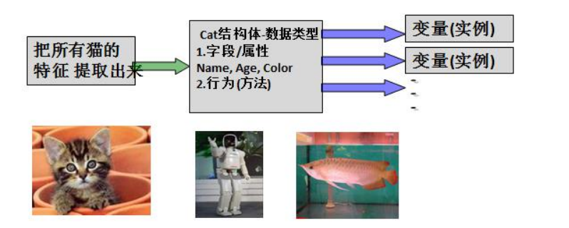
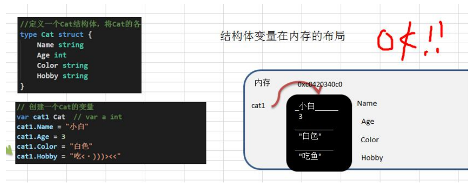

# 第 10 章面向对象编程(上)

## 10.1 结构体

### 10.1.1 看一个问题

> 张老太养了两只猫猫：一只名字叫小白，今年3岁，白色。还有一只叫小花，今年100岁，花色。
>
> 请编写一个程序，当用户输入小猫的名字时，显示该猫的名字，年龄，颜色。如果用户输入的小猫名错误，则显示张老太没有这只猫猫。

### 10.1.2 使用现有技术解决

**1) 单独的定义变量解决**

```go
// 1. 使用变量处理
var cat1Name string = "小白"
var cat1Age int = 3
var cat1Color string = "白色"

var cat2Name string = "小花"
var cat2Age int = 100
var cat2Color string = "花色"
```

**2) 使用数组解决**

```go
// 2. 使用数组
var catNames = [...]string{cat1Name, cat2Name}
var catAges = [...]int{cat1Age, cat2Age}
var catColors = [...]string{cat1Color, cat2Color}
```

### 10.1.3 现有技术解决的缺点分析

1) 使用变量或者数组来解决养猫的问题，不利于数据的管理和维护。因为名字，年龄，颜色都是属于一只猫，但是这里是分开保存。

2) 如果我们希望对一只猫的属性（名字、年龄，颜色）进行操作(绑定方法)，也不好处理。

3) 引出我们要讲解的技术 -->  **结构体**。

### 10.1.4 一个程序就是一个世界，有很多对象(变量)

### 10.1.5 Golang 语言面向对象编程说明

1. Golang 也支持面向对象编程(OOP)，但是和传统的面向对象编程有区别，并不是纯粹的面向对象语言。**所以我们说 Golang 支持面向对象编程特性是比较准确的。**
2. Golang 没有类(class)，Go 语言的结构体(struct)和其它编程语言的类(class)有同等的地位，你可以理解 Golang 是基于 struct 来实现 OOP 特性的。
3. Golang 面向对象编程非常简洁，去掉了传统 OOP 语言的继承、方法重载、构造函数和析构函数、隐藏的 this 指针等等
4. Golang 仍然有面向对象编程的继承，封装和多态的特性，只是实现的方式和其它OOP语言不一样，比如继承 ：Golang 没有 extends 关键字，继承是通过匿名字段来实现。
5. Golang 面向对象(OOP)很优雅，OOP 本身就是语言类型系统(type system)的一部分，通过接口(interface)关联，耦合性低，也非常灵活。后面同学们会充分体会到这个特点。也就是说在Golang中面向接口编程是非常重要的特性。

### 10.1.6 结构体与结构体变量(实例/对象)的关系示意图



对上图的说明

> 1) 将一类事物的特性提取出来(比如猫类)， 形成一个新的数据类型，就是一个结构体。
>
> 2) 通过这个结构体，我们可以创建多个变量(实例/对象) 
> 3) 事物可以猫类，也可以是 Person ， Fish 或是某个工具类。。。

注意：从猫结构体到变量，就是创建一个Cat结构体变量，也可以说是定义一个Cat结构体变量，当然：上面的猫也可以是鱼、狗、人。

### 10.1.7 快速入门-面向对象的方式(struct)解决养猫问题

```go
func oopDemo2() {
    var cat1 Cat
    cat1.Name = "小白"
    cat1.Age = 3
    cat1.Color = "白色"
    cat1.Hobby = "吃<.)))><<"
    fmt.Println("cat1=", cat1)
    
    fmt.Println("猫猫的信息如下：")
    fmt.Println("name=", cat1.Name)
    fmt.Println("Age=", cat1.Age)
    fmt.Println("Color=", cat1.Color)
    fmt.Println("Hobby=", cat1.Hobby)
}
```

输出内容：

```go
cat1= {小白 3 白色 吃<.)))><<}
猫猫的信息如下：
name= 小白
Age= 3
Color= 白色
Hobby= 吃<.)))><<
```

### 10.1.8 结构体和结构体变量(实例)的区别和联系

> 通过上面的案例和讲解我们可以看出:
>
> 1) 结构体是自定义的数据类型，代表一类事物
>
> 2. 结构体变量(实例)是具体的，实际的，代表一个具体变量

### 10.1.9 结构体变量(实例)在内存的布局(重要!)



### 10.1.10 如何声明结构体

```go
// 基本语法
type 结构体名称 struct {
    field1 type
    field2 type
}

// 举例
type Student struct {
    Name string //字段
    Age int //字段
    Score float32
}
```

### 10.1.11 字段/属性

**基本介绍**

1. 从概念或叫法上看： 结构体字段 = 属性 = field （即授课中，统一叫字段)
2. 字段是结构体的一个组成部分，一般是**基本数据类型**、**数组**,也可是**引用类型**。比如我们前面定义猫结构体 的 Name string 就是属性

**注意事项和细节说明**

1. 字段声明语法同变量，示例：字段名 字段类型
2. 字段的类型可以为：基本类型、数组或引用类型
3. 在创建一个结构体变量后，如果没有给字段赋值，都对应一个零值(默认值)，规则同前面讲的一样:

布尔类型是 false ，数值是 0 ，字符串是 ""。

数组类型的默认值和它的元素类型相关，比如 score [3]int 则为[0, 0, 0]

**指针，slice，和 map 的零值都是 nil ，即还没有分配空间。**

```go
type Person struct {
    Name   string
    Age    int
    Scores [5]float64
    ptr    *int              // 指针
    slice  []int             // 切片
    map1   map[string]string // map
}

func oopDemo3() {
    var p1 Person
    fmt.Println(p1)

    if p1.ptr == nil {
       fmt.Println("ok1:", p1.ptr)
    }

    if p1.slice == nil {
       fmt.Println("ok2:", p1.slice)
    }

    if p1.map1 == nil {
       fmt.Println("ok3:", p1.map1)
    }

    // 使用slice前一定要make
    p1.slice = make([]int, 3)
    p1.slice[0] = 100 // ok

    // 使用amp，一定要先make
    p1.map1 = make(map[string]string)
    p1.map1["key1"] = "tom"

    fmt.Println(p1)
}
```

输出：

```go
{ 0 [0 0 0 0 0] <nil> [] map[]}
ok1: <nil>
ok2: []
ok3: map[]
{ 0 [0 0 0 0 0] <nil> [100 0 0] map[key1:tom]}
```

4) 不同结构体变量的字段是独立，互不影响，一个结构体变量字段的更改，不影响另外一个, **结构体是值类型**。