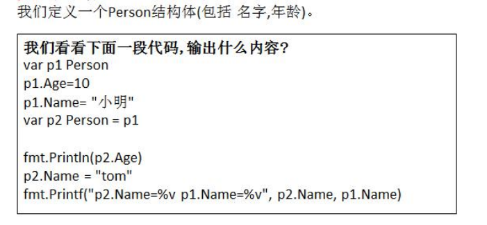
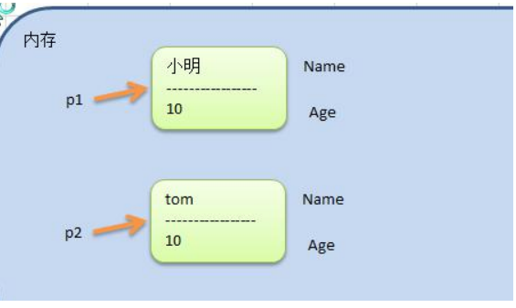
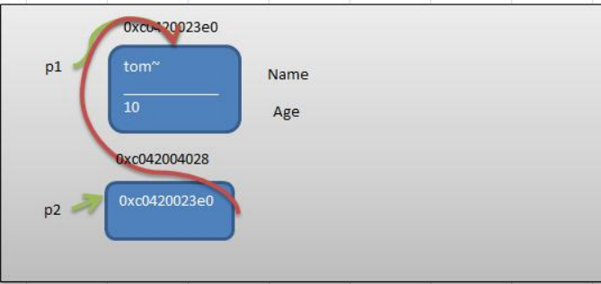
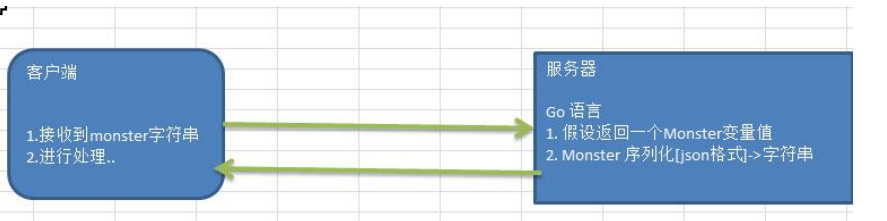
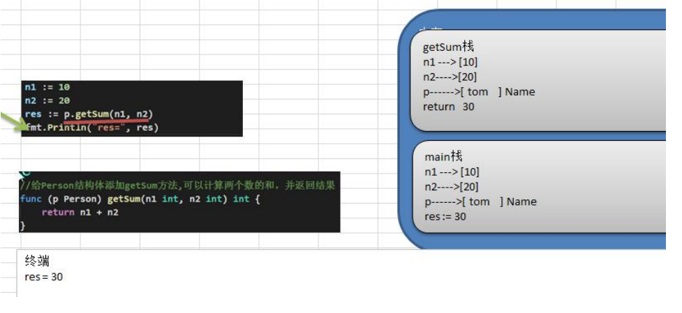
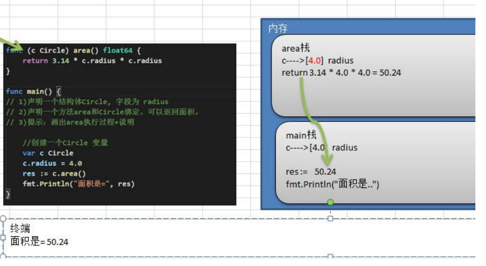
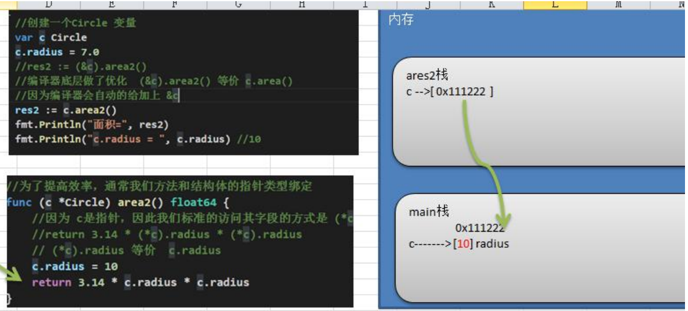

# 第 10 章面向对象编程(上)

## 10.1 结构体

### 10.1.1 看一个问题

> 张老太养了两只猫猫：一只名字叫小白，今年3岁，白色。还有一只叫小花，今年100岁，花色。
>
> 请编写一个程序，当用户输入小猫的名字时，显示该猫的名字，年龄，颜色。如果用户输入的小猫名错误，则显示张老太没有这只猫猫。

### 10.1.2 使用现有技术解决

**1) 单独的定义变量解决**

```go
// 1. 使用变量处理
var cat1Name string = "小白"
var cat1Age int = 3
var cat1Color string = "白色"

var cat2Name string = "小花"
var cat2Age int = 100
var cat2Color string = "花色"
```

**2) 使用数组解决**

```go
// 2. 使用数组
var catNames = [...]string{cat1Name, cat2Name}
var catAges = [...]int{cat1Age, cat2Age}
var catColors = [...]string{cat1Color, cat2Color}
```

### 10.1.3 现有技术解决的缺点分析

1) 使用变量或者数组来解决养猫的问题，不利于数据的管理和维护。因为名字，年龄，颜色都是属于一只猫，但是这里是分开保存。

2) 如果我们希望对一只猫的属性（名字、年龄，颜色）进行操作(绑定方法)，也不好处理。

3) 引出我们要讲解的技术 -->  **结构体**。

### 10.1.4 一个程序就是一个世界，有很多对象(变量)

### 10.1.5 Golang 语言面向对象编程说明

1. Golang 也支持面向对象编程(OOP)，但是和传统的面向对象编程有区别，并不是纯粹的面向对象语言。**所以我们说 Golang 支持面向对象编程特性是比较准确的。**
2. Golang 没有类(class)，Go 语言的结构体(struct)和其它编程语言的类(class)有同等的地位，你可以理解 Golang 是基于 struct 来实现 OOP 特性的。
3. Golang 面向对象编程非常简洁，去掉了传统 OOP 语言的继承、方法重载、构造函数和析构函数、隐藏的 this 指针等等
4. Golang 仍然有面向对象编程的继承，封装和多态的特性，只是实现的方式和其它OOP语言不一样，比如继承 ：Golang 没有 extends 关键字，继承是通过匿名字段来实现。
5. Golang 面向对象(OOP)很优雅，OOP 本身就是语言类型系统(type system)的一部分，通过接口(interface)关联，耦合性低，也非常灵活。后面同学们会充分体会到这个特点。也就是说在Golang中面向接口编程是非常重要的特性。

### 10.1.6 结构体与结构体变量(实例/对象)的关系示意图


对上图的说明

> 1) 将一类事物的特性提取出来(比如猫类)， 形成一个新的数据类型，就是一个结构体。
>
> 2) 通过这个结构体，我们可以创建多个变量(实例/对象) 
> 3) 事物可以猫类，也可以是 Person ， Fish 或是某个工具类。。。

注意：从猫结构体到变量，就是创建一个Cat结构体变量，也可以说是定义一个Cat结构体变量，当然：上面的猫也可以是鱼、狗、人。

### 10.1.7 快速入门-面向对象的方式(struct)解决养猫问题

```go
func oopDemo2() {
    var cat1 Cat
    cat1.Name = "小白"
    cat1.Age = 3
    cat1.Color = "白色"
    cat1.Hobby = "吃<.)))><<"
    fmt.Println("cat1=", cat1)
    
    fmt.Println("猫猫的信息如下：")
    fmt.Println("name=", cat1.Name)
    fmt.Println("Age=", cat1.Age)
    fmt.Println("Color=", cat1.Color)
    fmt.Println("Hobby=", cat1.Hobby)
}
```

输出内容：

```go
cat1= {小白 3 白色 吃<.)))><<}
猫猫的信息如下：
name= 小白
Age= 3
Color= 白色
Hobby= 吃<.)))><<
```

### 10.1.8 结构体和结构体变量(实例)的区别和联系

> 通过上面的案例和讲解我们可以看出:
>
> 1) 结构体是自定义的数据类型，代表一类事物
>
> 2. 结构体变量(实例)是具体的，实际的，代表一个具体变量

### 10.1.9 结构体变量(实例)在内存的布局(重要!)


### 10.1.10 如何声明结构体

```go
// 基本语法
type 结构体名称 struct {
    field1 type
    field2 type
}

// 举例
type Student struct {
    Name string //字段
    Age int //字段
    Score float32
}
```

### 10.1.11 字段/属性

**基本介绍**

1. 从概念或叫法上看： 结构体字段 = 属性 = field （即授课中，统一叫字段)
2. 字段是结构体的一个组成部分，一般是**基本数据类型**、**数组**,也可是**引用类型**。比如我们前面定义猫结构体 的 Name string 就是属性

**注意事项和细节说明**

1. 字段声明语法同变量，示例：字段名 字段类型
2. 字段的类型可以为：基本类型、数组或引用类型
3. 在创建一个结构体变量后，如果没有给字段赋值，都对应一个零值(默认值)，规则同前面讲的一样:

布尔类型是 false ，数值是 0 ，字符串是 ""。

数组类型的默认值和它的元素类型相关，比如 score [3]int 则为[0, 0, 0]

**指针，slice，和 map 的零值都是 nil ，即还没有分配空间。**

```go
type Person struct {
    Name   string
    Age    int
    Scores [5]float64
    ptr    *int              // 指针
    slice  []int             // 切片
    map1   map[string]string // map
}

func oopDemo3() {
    var p1 Person
    fmt.Println(p1)

    if p1.ptr == nil {
       fmt.Println("ok1:", p1.ptr)
    }

    if p1.slice == nil {
       fmt.Println("ok2:", p1.slice)
    }

    if p1.map1 == nil {
       fmt.Println("ok3:", p1.map1)
    }

    // 使用slice前一定要make
    p1.slice = make([]int, 3)
    p1.slice[0] = 100 // ok

    // 使用amp，一定要先make
    p1.map1 = make(map[string]string)
    p1.map1["key1"] = "tom"

    fmt.Println(p1)
}
```

输出：

```go
{ 0 [0 0 0 0 0] <nil> [] map[]}
ok1: <nil>
ok2: []
ok3: map[]
{ 0 [0 0 0 0 0] <nil> [100 0 0] map[key1:tom]}
```

4) 不同结构体变量的字段是独立，互不影响，一个结构体变量字段的更改，不影响另外一个, **结构体是值类型**。

### 10.1.12 创建结构体变量和访问结构体字段

- 方式 1-直接声明

  > 案例演示: var person Person 前面我们已经说了。

- 方式 2-{}

  > ```go
  > // 案例演示: var person Person = Person{}
  > type Person2 struct {
  >     Name string
  >     Age  int
  > }
  > 
  > func oopDemo4() {
  >     p2 := Person2{"mary", 20}
  >     //p2.Name = "tom"
  > 	//p2.Age = 18
  >     fmt.Println(p2) // {mary 20}
  > }
  > ```

- 方式 3-&

  > ```go
  > // 案例: var person *Person = new (Person)
  > func oopDemo5() {
  >     var p3 *Person2 = new(Person2)
  >     // 因为p3是一个指针，因此标准的给字段赋值的方式
  >     (*p3).Name = "tom"
  >     p3.Age = 25 // 这样也行。原因：go的设计者为了程序使用方便，底层会对p3.Age = 25 进行处理。会给 p3 加上取值运算 (*p3).Age = 25
  >     fmt.Println(p3) // &{tom 25}
  > }
  > ```

- 方式 4-{}

  > ```go
  > func oopDemo6() {
  >     var person *Person2 = &Person2{}
  >     // 也可以直接赋值
  >     // var person *Person2 = &Person2{"tom", 20}
  >     // 因为p3是一个指针，因此标准的给字段赋值的方式
  >     //person 是个指针，因此下面访问方式都有可以
  >     (*person).Name = "lucy"
  >     person.Age = 20
  >     fmt.Println(person) // &{lucy 20}
  > }
  > ```

说明：

1) 第 3 种和第 4 种方式返回的是 **结构体指针**。

2) 结构体指针访问字段的标准方式应该是：`(*结构体指针).字段名 ，比如(*person).Name ="tom"`

3) 但 go 做了一个简化，也支持 结构体指针.字段名, 比如 person.Name = "tom"。更加符合程序员使用的习惯，**go 编译器底层 对 person.Name 做了转化 (*person).Name。**

### 10.1.13 struct 类型的内存分配机制(memory_allocated.go)

**看一个思考题**



**输出的结果是**: p2.Name = tom p1.Name = 小明

**基本说明**

> 变量总是存在内存种，那么结构体变量在内存种酒精是怎样存在的？

**结构体在内存中示意图**



**看下面代码，并分析原因**

```go
package main

import "fmt"

type Person3 struct {
    Name string
    Age  int
}

func main() {
    var p1 Person3
    p1.Age = 10
    p1.Name = "小明"

    var p2 *Person3 = &p1 // 这里是关键--> 画出示意图

    //fmt.Println(*p2.Age) // 不能这样写，会报错，因为.的优先级比 * 的高
    fmt.Println((*p2).Age)
    fmt.Println(p2.Age)

    p2.Name = "tom~"
    fmt.Printf("p2.Name=%v p1.Name=%v \n", p2.Name, p1.Name)    // tom~ tom~
    fmt.Printf("p2.Name=%v p1.Name=%v \n", (*p2).Name, p1.Name) // tom~ tom~

    fmt.Printf("p1的地址%p \n", &p1)
    fmt.Printf("p2的地址%p p2的值%p \n", &p2, p2)
}
```

输出内容：

```go
10
10
p2.Name=tom~ p1.Name=tom~ 
p2.Name=tom~ p1.Name=tom~ 
p1的地址0xc00011c060 
p2的地址0xc00014c018 p2的值0xc00011c060 
```

上面代码对应的内存图的分析：



### 10.1.14 结构体使用注意事项和细节

\1) 结构体的所有字段在内存中是连续的

```go
package main

import "fmt"

// 结构体
type Point struct {
    x int
    y int
}

// 结构体
type Rect struct {
    leftUp, rightDown Point
}

// 结构体2
type Rect2 struct {
    leftUp, rightDown *Point
}

func main() {
    r1 := Rect{Point{1, 2}, Point{3, 4}}
    // r1 有四个int，在内存中是连续分布的
    fmt.Printf("r1.leftUp.x 地址=%p r1.leftUp.y 地址=%p r1.rightDown.x 地址=%p r1.rightDown.y 地址=%p \n",
       &r1.leftUp.x, &r1.leftUp.y, &r1.rightDown.x, &r1.rightDown.y)

    // r2 有两个 *Point类型，这个两个 *Point 类型的本身地址也是连续的
    // 但是他们指向的地址不一定连续
    r2 := Rect2{&Point{10, 20}, &Point{30, 40}}
    // 打印地址
    fmt.Printf("r2.leftUp 地址=%p r2.rightDown 地址=%p \n",
       &r2.leftUp, &r2.rightDown)

    // 他们指向的地址不一定是连续的....，这个要看系统运行时时如何分配的
    fmt.Printf("r2.leftUp 指向地址=%p r2.rightDown 指定地址=%p \n",
       r2.leftUp, r2.rightDown)
}
```

输出结果：

```go
r1.leftUp.x 地址=0xc0000101c0 r1.leftUp.y 地址=0xc0000101c8 r1.rightDown.x 地址=0xc0000101d0 r1.rightDown.y 地址=0xc0000101d8 
r2.leftUp 地址=0xc00004a250 r2.rightDown 地址=0xc00004a258 
r2.leftUp 指向地址=0xc0000180b0 r2.rightDown 指定地址=0xc0000180c0 
```

\2) 结构体是用户单独定义的类型，和其它类型进行转换时需要有完全相同的字段(名字、个数和类型)

\3) 结构体进行 type 重新定义(相当于取别名)，Golang 认为是新的数据类型，但是相互间可以强转

```go
type Student struct {
    Name string
    Age  int
}

type Stu Student

func test01() {
    var stu1 Student
    var stu2 Stu
    //stu2 = stu1  // 这里是错误的，下面是对的
    stu2 = Stu(stu1)
    fmt.Println(stu1, stu2)
}

type integer int

func test02() {
	var i integer = 10
	var j int = 20
	//j = i // 错误
	j = int(i)
	fmt.Println(i, j)
}
```

\4) struct 的每个字段上，可以写上一个 tag, 该 tag 可以通过反射机制获取，常见的使用场景就是序列化和反序列化。

序列化的使用场景:



```go
type Monster struct {
    Name  string `json:"name"` // `json:"name"` 就是 struct tag
    Age   int    `json:"age"`
    skill string `json:"skill"`
}

func test03() {
    // 1. 创建一个monster变量
    monster := Monster{"牛魔王", 500, "芭蕉扇"}

    // 2.将monster变量序列化为json格式字串
    // json.Marshal(monster) 函数中使用反射，这个讲解反射时，会详细介绍
    jsonstr, err := json.Marshal(monster)
    if err != nil {
       fmt.Println("json处理错误", err)
    }
    fmt.Println("jsonStr", string(jsonstr))
}
```

## 10.2 方法

### 10.2.1 基本介绍

在某些情况下，我们要需要声明(定义)方法。比如 Person 结构体:除了有一些字段外( 年龄，姓名..),Person 结构体还有一些行为比如:可以说话、跑步..,通过学习，还可以做算术题。这时就要用方法才能完成。

Golang 中的方法是**作用在指定的数据类型上的**(即：和指定的数据类型绑定)，因此**自定义类型**，**都可以有方法**，而不仅仅是 **struct**。

### 10.2.2 方法的声明和调用

```go
type A struct {
	Num int
}
func (a A) test() {
	fmt.Println(a.Num)
}
```

对上面的语法的说明

1) func (a A) test() {} 表示 A 结构体有一方法，方法名为 test
2) (a A) 体现 test 方法是和 A 类型绑定的

举例说明

```go
func main() {
	var stu Student
    stu.Name = "tom"
    stu.test()
}

type Student struct {
    Name string
    Age  int
}

func (stu Student) test() {
    fmt.Println("test() name=", stu.Name)
}
```

对上面的总结

\1) test 方法和 Student类型绑定

\2) test 方法只能通过 Student类型的变量来调用，而不能直接调用，也不能使用其它类型变量来调用

\3) func (stu Student) test() {}... stu 表示哪个 Student变量调用，这个 stu 就是它的副本, 这点和函数传参非常相似。

\4) stu 这个名字，有程序员指定，不是固定, 比如修改成 student 也是可以

### 10.2.3 方法快速入门

\1) 给 Student 结构体添加 speak 方法,输出 xxx 是一个好人

```go
func (stu Student) speak() {
    fmt.Println(stu.Name, "是一个好人")
}
```

\2) 给 Student  结构体添加 jisuan 方法,可以计算从 1+..+1000 的结果, 说明方法体内可以函数一样，进行各种运算

```go
func (stu Student) jisaun() {
    res := 0
    for i := 1; i <= 100; i++ {
       res += i
    }
    fmt.Println(stu.Name, "计算的结果时=", res)
}
```

\3) 给 Person 结构体 jisuan2 方法,该方法可以接收一个数 n，计算从 1+..+n 的结果  

```go
func (stu Student) jisaun2(n int) {
    res := 0
    for i := 1; i <= n; i++ {
       res += i
    }
    fmt.Println(stu.Name, "计算的结果时=", res)
}
```

\4) 给 Person 结构体添加 getSum 方法,可以计算两个数的和，并返回结果

```go
func (stu Student) getSum(n1 int, n2 int) int {
    return n1 + n2
}
```

\5) 方法的调用

```go
stu.speak()
stu.jisaun()
stu.jisaun2(20)
res := stu.getSum(10, 20)
fmt.Println("res=", res)
```

### 10.2.4 方法的调用和传参机制原理：(重要！)

说明：

>  方法的调用和传参机制和函数基本一样，不一样的地方是方法调用时，会将调用方法的变量，当做实参也传递给方法。下面我们举例说明。

案例 1：

> 画出前面 getSum 方法的执行过程+说明



说明:

> \1) 在通过一个变量去调用方法时，其调用机制和函数一样
>
> \2) 不一样的地方时，变量调用方法时，该变量本身也会作为一个参数传递到方法(如果变量是值类型，则进行值拷贝，如果变量是引用类型，则进行地质拷贝)

案例 2

> 请编写一个程序，要求如下：
>
> \1) 声明一个结构体 Circle, 字段为 radius 
>
> \2) 声明一个方法 area 和 Circle 绑定，可以返回面积。 
>
> \3) 提示：画出 area 执行过程+说明

```go
type Circle struct {
    radius float64
}

func (c Circle) area() float64 {
    return 3.14 * c.radius * c.radius
}

func main() {
	var c Circle
	c.radius = 4.0
	res1 := c.area()
	fmt.Println("res1=", res1)
}
```



### 10.2.5 方法的声明(定义)

```go
func (recevier type) methodName (参数列表)(返回值列表) {
	方法体
    return 返回值
}
```

> \1) 参数列表：表示方法输入
>
> \2) recevier type : 表示这个方法和 type 这个类型进行绑定，或者说该方法作用于type 类型
>
> \3) receiver type : type 可以是结构体，也可以其它的自定义类型
>
> \4) receiver : 就是 type 类型的一个变量(实例)，比如 ：Person 结构体的一个变量(实例)
>
> \5) 返回值列表：表示返回的值，可以多个
>
> \6) 方法主体：表示为了**实现某一功能代码**块
>
> \7) return 语句不是必须的。

### 10.2.6 方法的注意事项和细节

\1) 结构体类型是值类型，在方法调用中，遵守值类型的传递机制，是值拷贝传递方式

\2) 如程序员希望在方法中，修改结构体变量的值，可以通过结构体指针的方式来处理



\3) Golang 中的方法作用在指定的数据类型上的(即：和指定的数据类型绑定)，因此自定义类型，都可以有方法，而不仅仅是 struct， 比如 int , float32 等都可以有方法

```go
// Golang 中的方法作用在指定的数据类型上的(即：和指定的数据类型绑定)，因此自定义类型，都可以有方法，而不仅仅是 struct， 比如 int , float32 等都可以有方法

func (i integer) print() {
    fmt.Println("i=", i)
}

// 编写一个方法，可以改变i的值

func (i *integer) change() {
    *i = *i + 1
}

func main() {
    var i integer = 10
	i.print()
	i.change()
	fmt.Println("main中的i=", i)
}
```

\4) 方法的访问范围控制的规则，和函数一样。**方法名首字母小写，只能在本包访问，方法首字母大写，可以在本包和其它包访问**。[讲解]

\5) 如果一个类型实现了 String()这个方法，那么 fmt.Println 默认会调用这个变量的String()进行输出

```go
type Student struct {
    Name string
    Age  int
}

func (stu *Student) String() string {
    str := fmt.Sprintf("Name=[%v], Age=[%v]", stu.Name, stu.Age)
    return str
}

func main() {
    stu1 := Student{
		Name: "zs",
		Age:  20,
	}
	fmt.Println(&stu1) // Name=[zs], Age=[20]
}
```

### 10.2.7 方法的课堂练习题

\1) 编写结构体(MethodUtils)，编程一个方法，方法不需要参数，在方法中打印一个10*8 的矩形，在 main 方法中调用该方法。

```go
package main

import "fmt"

func main() {
    var mu MethodUtils
    mu.Print()
}

type MethodUtils struct {
}

func (mu MethodUtils) Print() {
    for i := 1; i <= 10; i++ {
       for j := 1; j <= 8; j++ {
          fmt.Print("*")
       }
       fmt.Println()
    }
}
```

\2) 编写一个方法，提供 m 和 n 两个参数，方法中打印一个 m*n 的矩形

略

\3) 编写一个方法算该矩形的面积(可以接收长 len，和宽 width)， 将其作为方法返回值。在main方法中调用该方法，接收返回的面积值并打印。

略

\4) 编写方法：判断一个数是奇数还是偶数

略

\5) 根据行、列、字符打印 对应行数和列数的字符，比如：行：3，列：2，字符*,则打印相应的效果

略

\6) 定义小小计算器结构体(Calcuator)，实现加减乘除四个功能

> 实现形式 1：分四个方法完成
>
> 实现形式 2：用一个方法搞定

### 10.2.8 方法的课后练习题

\1) 在MethodUtils 结构体中编写个方法，从键盘接受整数1-9，打印对应的乘法表

```go
// 这里省略从键盘接受整数1-9
func (mu MethodUtils) PrintMulTable(n int) {
    for i := 1; i <= n; i++ {
       for j := 1; j <= i; j++ {
          fmt.Printf("%v * %v = %v\t", j, i, j*i)
       }
       fmt.Println()
    }
}
```

\2) 编写一个方法，使给定的一个二维数组(3 * 3) 转置

```go
func (mu MethodUtils) transpose(matrix [][]int) [][]int {
    rows := len(matrix)
    cols := len(matrix[0])
    var res = make([][]int, cols)
    // 初始化数组
    for i := 0; i < cols; i++ {
       res[i] = make([]int, rows)
    }

    for i := 0; i < rows; i++ {
       for j := 0; j < cols; j++ {
          res[j][i] = matrix[i][j]
       }
    }
    return res
}
```

### 10.2.9 方法和函数区别

1) 调用方式不一样 

   >  函数的调用方式: 函数名(实参列表) 
   >
   > 方法的调用方式: 变量.方法名(实参列表)

2. 对于普通函数，接收者为值类型时，不能将指针类型的数据直接传递，反之亦然

   ```go
   func (p Person) test01() {
       
   }
   
   func (p *Person) test02() {
       
   }
   
   func main() {
       // 调用时
       p := Person{"tom"}
       // 下面两个参数不能反过来传递
       test01(p) 
       test02(&p)  
   }
   ```

3. 对于方法（如 struct 的方法），接收者为值类型时，可以直接用指针类型的变量调用方法，反过来同样也可以

总结:

\1) 不管调用形式如何，真正决定是值拷贝还是地址拷贝，看这个方法是和哪个类型绑定. 

\2) 如果是和值类型，比如 (p Person) , 则是值拷贝， 如果和指针类型，比如是(p *Person) 则是地址拷贝。

## 10.3 面向对象编程应用实例
