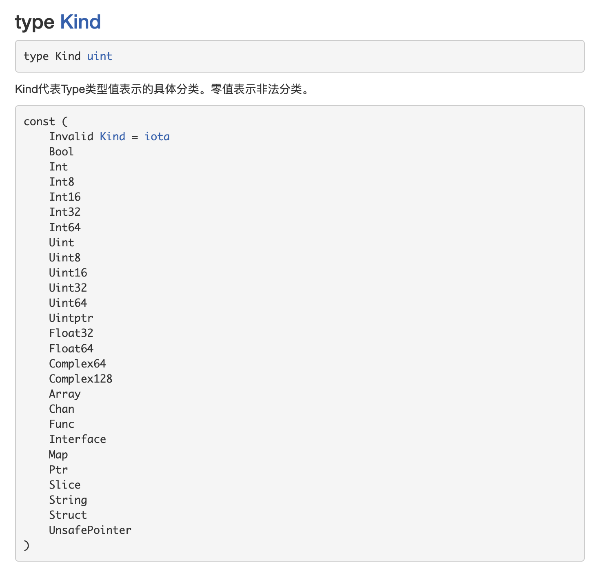
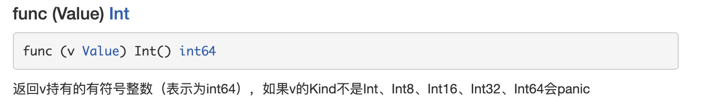

# 第17章反射

## 17.1 先看一个问题，反射的使用场景

```go
package main

import (
    "encoding/json"
    "fmt"
)

func main() {
    m := Monster{
       Name: "玉兔精",
       Age:  20,
       Sal:  888.99,
       Sex:  "female",
    }
    data, _ := json.Marshal(m)
    fmt.Println("json result:", string(data))
}

type Monster struct {
    Name string  `json:"monsterName"`
    Age  int     `json:"monsterAge"`
    Sal  float64 `json:"monsterSal"`
    Sex  string  `json:"monsterSex"`
}
```

> 输出结果：
>
> json result: {"monsterName":"玉兔精","monsterAge":20,"monsterSal":888.99,"monsterSex":"female"}
>
> 思考问题：
>
> 为什么序列化后，key-val 的key值时结构体Tag的值，而不是字段的名称，比如：不是Name而是
>
> monsterName
>
> **引出反射**：学习完reflect之后，回头再开看看

## 17.2 使用反射机制，编写函数的适配器, 桥连接

```go
// 1）定义了两个匿名函数
test1 := func(v1 int, v2 int) {
  t.Log(v1, v2)
}

test2 := func(v1 int, v2 int, s string) {
  t.Log(v1, v2, s)
}

// 2) 定义一个适配器函数用作统一处理接口，其大致结构如下：
bridge := func(call interface{}, args ...interface{}) {
   // 内容
}
// 实现调用test1对应的函数
bridge(test1, 1, 2)
// 实现调用test2对应的函数
bridge(test2, 1, 2, "test2")

// 3) 要求使用反射机制完成(note：学习reflect后，回头来解决)
```

## 17.3 反射的基本介绍

### 17.3.1 基本介绍

1) 反射可以在运行时动态获取变量的各种信息, 比如变量的类型(type)，类别(kind) 
2) 如果是结构体变量，还可以获取到结构体本身的信息(包括结构体的字段、方法) 
3) 通过反射，可以修改变量的值，可以调用关联的方法。 
4) 使用反射，需要 import (“reflect”)

5) 示意图


### 17.3.2 反射的应用场景

发射常见应用场景有以下两种

1）不知道接口调用哪个函数，根据传入参数在运行时确定调用的具体接口，这种需要对函数或方法反射。例如一下这种桥接模式，比如我前面提出问题。

```go
func bridge(funcPtr interface{}, args ...interface{})
```

第一个参数funcPtr以接口的形式传入函数指针，函数参数args以可变参数的形式传入，bridge函数中可以用反射来动态执行funcPtr函数

2）对结构体序列化时，如果结构体有指定Tag，也会使用反射生成对应的字符串

```go
package main

import (
    "encoding/json"
    "fmt"
)

func main() {
    m := Monster{
       Name: "玉兔精",
       Age:  20,
       Sal:  888.99,
       Sex:  "female",
    }
    data, _ := json.Marshal(m)
    fmt.Println("json result:", string(data))
}

type Monster struct {
    Name string  `json:"monsterName"`
    Age  int     `json:"monsterAge"`
    Sal  float64 `json:"monsterSal"`
    Sex  string  `json:"monsterSex"`
}
```

### 17.3.3 反射重要的函数和概念

1) reflect.TypeOf(变量名)，获取变量的类型，返回reflect.Type类型

2. reflect.ValueOf(变量名)，获取变量的值，返回reflect.Value类型reflect.Value 是一个结构体类型。【**看文档**】,通过reflect.Value，可以获取关于变量的很多信息。


3) 变量、interface{} 和 reflect.Value 是可以相互转换的，这点在实际开发中，会经常使用到。画出示意图


## 17.4 反射的快速入门 

### 17.4.1 快速入门说明

请编写一个案例，演示对(基本数据类型、interface{}、reflect.Value)进行反射的基本操作代码演示，

见下面的表格：

```java
func main() {
	// 请编写一个案例，演示对(基本数据类型、interface{}、reflect.Value)进行反射的基本操作
	var num int = 100
	reflectTest01(num)
}

// 专门演示反射
func reflectTest01(b interface{}) {
    // 通过反射获取的传入的变量的 type , kind, 值

    // 1. 先获取到 reflect.Type
    rTyp := reflect.TypeOf(b)
    fmt.Println("rTyp=", rTyp)

    // 2. 获取到reflect.Value
    rVal := reflect.ValueOf(b)
    // 这里不能直接 2 + rVal，rVal是reflect.Value类型
    n2 := 2 + rVal.Int()
    fmt.Println("n2=", n2)

    fmt.Printf("rVal=%v rVal type=%T\n", rVal, rVal)

    // 下面我们将 rVal 转成 interface{}
    iV := rVal.Interface()

    // 将interface{} 通过断言转成需要的类型
    num2 := iV.(int)
    fmt.Println("num2=", num2)
}
```

请编写一个案例，演示对(结构体类型、interface{}、reflect.Value)进行反射的基本操作

代码演示：

```go
func main() {
	//2. 定义一个 Student 的实例
	stu := Student{
		Name: "tom",
		Age:  20,
	}
	reflectTest02(stu)
}

// 专门演示反射[对结构体的反射]
func reflectTest02(b interface{}) {
    // 通过反射获取的传入的变量的 type , kind, 值
    // 1. 先获取到 reflect.Type
    vTyp := reflect.TypeOf(b)
    fmt.Println("vTyp=", vTyp)

    // 2. 获取到reflect.Value
    rVal := reflect.ValueOf(b)

    // 下面我们将 rVal 转成 interface{}
    iV := rVal.Interface()
    fmt.Printf("iv=%v iv type=%T \n", iV, iV)

    // 将 interface{} 通过断言转成需要的类型
    // 这里，我们就简单使用了一带检测的类型断言
    // 同学们可以使用 swtich 的断言形式来做的更加的灵活
    stu, ok := iV.(Student)
    if ok {
       fmt.Printf("stu.Name=%v\n", stu.Name)
    }
}
```

## 17.5 反射的注意事项和细节

1. reflect.Value.Kind，获取变量的类别，返回的是一个常量



2) Type 和 Kind 的区别

   ```go
   // Type 是类型，Kind 是类别，Type和kind可能是相同的
   // 比如：var num int = 10   num的Type是int，Kind也是int
   // 比如：var stu Student    stu的type是pkg1.Student, Kind是struct
   ```

3) 通过反射可以在让变量在interface{}和Reflect.Value之间进行转换，这点在前面画过的示意图并在快读入门案例中讲解过了，这里我们看下是如何在diamanté中体现的

4) 使用反射的方式来获取变量的值（并返回对应的类型），要求数据类型匹配，比如x是int，那么就应该使用reflect.Value(x).int()，而不能使用其它的，否则报panic

5. 通过反射的来修改变量。注意使用SetXxx()方法来设置需要通过对应的指针类型来完成，这样才能改变传入的值，同时需要使用到 reflect.Value.Elem()方法

   ```go
   package main
   
   import (
       "fmt"
       "reflect"
   )
   
   func main() {
       var num = 10
       testInt(&num)
       fmt.Println("num=", num)
   }
   
   func testInt(b interface{}) {
       val := reflect.ValueOf(b)
       fmt.Printf("val type=%T\n", val)
       val.Elem().SetInt(20)
       fmt.Printf("val=%v\n", val) // 这里val返回的是地址
   }
   ```

6. Reflect.Value.Elem() 应该如何理解？

   ```go
   func main() {
   
       var n int = 100
       fn := reflect.ValueOf(&n)
       fn.Elem().SetInt(200)
       fmt.Printf("n=%v\n", n) // n=200
   
       // fn.Elem() 用于获取指针指向变量，类似下面
       var num1 = 100
       var b *int = &num1
       *b = 3
       fmt.Println("num1=", num1) // num1= 3
   }
   ```

## 17.6 反射课堂练习

1. 给你一个变量 var v float64 = 1.2 , 请使用反射来得到它的 reflect.Value, 然后获取对应的Type, Kind 和值，并将 reflect.Value 转换成 interface{} , 再将 interface{} 转换成float64

```go
func expDemo1(b interface{}) {
    // 获取Type
    rTyp := reflect.TypeOf(b)
    fmt.Println("rType=", rTyp) // rType= float64

    rKind := rTyp.Kind()
    fmt.Println("rKind=", rKind) // rKind= float64

    // 获取rVal
    rVal := reflect.ValueOf(b)
    fmt.Println("rVal=", rVal) // rVal= 1.2

    rKind2 := rVal.Kind()
    fmt.Println("rKind2=", rKind2) // rKind2= float64

    // 将reflect.Value转成interface
    iV := rVal.Interface()
    fmt.Println("iV=", iV) // iV= 1.2

    // 再将interface{} 转成float
    val := iV.(float64)
    fmt.Println("val=", val) // val= 1.2
}
```

2. 看段代码，判断是否正确，为什么？

```go
func expDemo2() {
    var str string = "tom"
    fs := reflect.ValueOf(str)  // 这里应该传入指针
    fs.SetString("jack")        // 这里要通过Elem()获取指针然后取修改值
    fmt.Printf("%v\n", str)
}

// 下面是正确的做法
func expDemo2() {
	var str string = "tom"
	fs := reflect.ValueOf(&str)
	fs.Elem().SetString("jack")
	fmt.Printf("%v\n", str)
}
```

> 这段代码编译是不会报错，但是运行会报错

## 17.7 反射最佳实践

1. 使用反射来遍历结构体的字段，调用结构体的方法，并获取结构体标签的值

```go
package main

import (
    "fmt"
    "reflect"
)

func main() {
    // 创建一个结构体
    animal := Animal{
       Name:  "黄大仙",
       Age:   "400",
       Score: 87.9,
    }

    //将 Animal 实例传递给 TestStruct 函数
    TestStruct(animal)
}

type Animal struct {
    Name  string `json:"name"`
    Age   string `json:"animal_age"`
    Score float32
    Sex   string
}

// 方法：返回两个数的和
func (s Animal) GetSum(num1 int, num2 int) int {
    return num1 + num2
}

// 方法：接受4个值，给s赋值
func (s Animal) Set(name string, Age string, score float32, sex string) {
    s.Name = name
    s.Age = Age
    s.Score = score
    s.Sex = sex
}

// 方法：显示s的值
func (s Animal) Print() {
    fmt.Println("----- start~ -----")
    fmt.Println(s)
    fmt.Println("----- end~ -----")
}

func TestStruct(a interface{}) {
    // 获取 reflect.Type 类型
    typ := reflect.TypeOf(a)
    // 获取 reflect.Value 类型
    val := reflect.ValueOf(a)
    // 获取a对应的类别，注意这里需要使用val
    kd := val.Kind()
    // 如果传入的不是struct,则退出
    if kd != reflect.Struct {
       fmt.Println("expect struct")
       return
    }
    // 获取结构体有几个字段
    num := val.NumField()
    fmt.Printf("struct has %d fields\n", num)
    // 变量结构体的所有字段
    for i := 0; i < num; i++ {
       fmt.Printf("Field %d: 值为=%v\n", i, val.Field(i))
       // 获取到struct 标签，注意需要通过 reflect.Type 类型来获取
       tagVal := typ.Field(i).Tag.Get("json")
       // 如果该字段于 tag 标签就显示，否则就不显示
       if tagVal != "" {
          fmt.Printf("Field %d: tag为=%v\n", i, tagVal)
       }
    }

    // 获取到该结构体有多少个方法
    numOfMethod := val.NumMethod()
    fmt.Printf("struct has %d methods\n", numOfMethod)

    // var params []reflect.Value
    // 方法的排序默认是按照 函数名的排序（ASCII 码）
    val.Method(1).Call(nil) // 获取第二个方法，并调用，这里调用的是print方法

    // 调用结构体的第1个方法 Method(0)
    var params []reflect.Value // 声明了 []reflect.Value
    params = append(params, reflect.ValueOf(10))
    params = append(params, reflect.ValueOf(40))
    res := val.Method(0).Call(params)
    fmt.Println("res=", res[0].Int())
}
```

2) 使用反射的方式来获取结构体的 tag 标签, 遍历字段的值，修改字段值，调用结构体方法(要求：通过传递地址的方式完成, 在前面案例上修改即可)

```go
// 修改结构体中的值
func TestStruct2(a interface{}) {
    // 获取 reflect.Type 类型
    typ := reflect.TypeOf(a)
    // 获取 reflect.Value 类型
    val := reflect.ValueOf(a)
    // 获取a对应的类别，注意这里需要使用val
    kd := val.Kind()
    // 如果传入的不是Pointer,则退出，因为这里是修改，需要传入指针
    // 这里也可以用 kd != reflect.Ptr
    if kd != reflect.Pointer && val.Elem().Kind() == reflect.Struct {
       fmt.Println("expect struct")
       return
    }
    // 获取结构体有几个字段
    num := val.Elem().NumField()
    fmt.Printf("struct has %d fields\n", num)
    // 修改属性值
    val.Elem().Field(0).SetString("白骨精2")
    //val.Elem().FieldByName("Name").SetString("白骨精")

    // 获取tag
    tag := typ.Elem().Field(0).Tag.Get("json")
    fmt.Printf("tag=%s\n", tag)

    // 获取方法的数量
    numOfMethod := val.Elem().NumMethod()
    fmt.Printf("struct has %d methods\n", numOfMethod)

    val.Elem().Method(1).Call(nil) // 调用的是print方法
}

func main() {
  animal := Animal{
		Name:  "黄大仙",
		Age:   "400",
		Score: 87.9,
	}
  // 修改Name的值，这里传入的是指针。注意对于指针获取和操作属性和方法都是使用val.Elem()
	TestStruct2(&animal)
	fmt.Println("修改后的Name=", animal.Name)
}
```

3) 定义了两个函数 test1 和 test2，定义一个适配器函数用作统一处理接口【了解】

```go
package test

import (
    "reflect"
    "testing"
)

// 案例3: 定义了两个函数 test1 和 test2，定义一个适配器函数用作统一处理接口【了解】
func TestReflectFunc(t *testing.T) {
    var (
       function reflect.Value
       inValue  []reflect.Value
       n        int
    )

    bridge := func(call interface{}, args ...interface{}) {
       n = len(args)
       inValue = make([]reflect.Value, n)
       for i := 0; i < n; i++ {
          inValue[i] = reflect.ValueOf(args[i])
       }
       function = reflect.ValueOf(call)
       function.Call(inValue)
    }

    call1 := func(v1 int, v2 int) {
       t.Log(v1, v2)
    }

    call2 := func(v1 int, v2 int, s string) {
       t.Log(v1, v2, s)
    }

    bridge(call1, 1, 2)
    bridge(call2, 1, 2, "test2")
}
```

4. 使用反射操作任意结构体类型：【了解】

```go
type user struct {
    UserId string
    Name   string
}

// 4，使用反射操作任意结构体类型：【了解】
func TestReflectStruct(t *testing.T) {
    var (
       model *user
       sv    reflect.Value
    )
    model = &user{}
    sv = reflect.ValueOf(model)
    t.Log("reflect.ValueOf", sv.Kind().String())
    sv = sv.Elem()
    t.Log("reflect.ValueOf.Elem", sv.Kind().String())
    sv.FieldByName("UserId").SetString("123")
    sv.FieldByName("Name").SetString("zhangsan")
    t.Log("model", model)
}
```

5) 使用反射创建并操作结构体

```go
// 5. 使用反射创建并操作结构体
func TestReflectStructPtr(t *testing.T) {
    var (
       model *user
       st    reflect.Type
       elem  reflect.Value
    )
    st = reflect.TypeOf(model)                       // 获取类型 *user
    t.Log("reflect.ValueOf", st.Kind().String())     // ptr
    st = st.Elem()                                   // st指向的类型
    t.Log("reflect.TypeOf.Elem", st.Kind().String()) // struct
    // New返回一个Value类型值，该值持有一个指向类型为type的新申请的零值的指针
    elem = reflect.New(st)
    t.Log("reflect.New", elem.Kind().String())
    t.Log("reflect.New.Elem", elem.Elem().Kind().String())
    // model就是创建的user结构体变量（实例）
    model = elem.Interface().(*user) // model是*user 它的指向和elem是一样的
    elem = elem.Elem()               // 取得elem指向的值
    elem.FieldByName("UserId").SetString("456")
    elem.FieldByName("Name").SetString("lisi")
    t.Log("model model.Name", model, model.Name)
}
```

## 17.8 课后练习

> 1. 编写一个Cal 结构体，有两个字段Num1和Num2
> 2. 方法 GetSub(name string)
> 3. 使用反射遍历Cal结构体所有的字段信息
> 4. 使用反射机制完成对GetSub 的调用，输出形式为 "tom 完成了减法运算，8 - 3 = 5"

```go
package main

import (
    "fmt"
    "reflect"
)

func main() {
    cal := Cal{
       Num1: 8,
       Num2: 3,
    }
    testReflectStruct(cal)
}

type Cal struct {
    Num1 int32 `json:"num1"`
    Num2 int32 `json:"num2"`
}

func (cl Cal) GetSub(name string) {
    res := cl.Num1 - cl.Num2
    fmt.Printf("%s 完成了减法运行，%d - %d = %d ", name, cl.Num1, cl.Num2, res)
}

func testReflectStruct(b interface{}) {
    // 获取Cal的字段信息
    typ := reflect.TypeOf(b)

    val := reflect.ValueOf(b)
    fieldNum := val.NumField()
    fmt.Printf("struct has %d fields\n", fieldNum)
    for i := 0; i < fieldNum; i++ {
       // 获取到struct 标签，注意需要通过 reflect.Type 类型来获取
       tagVal := typ.Field(i).Tag.Get("json")
       // 如果该字段于 tag 标签就显示，否则就不显示
       if tagVal != "" {
          fmt.Printf("Field %d: tag为=%v\n", i, tagVal)
       }
    }

    var params []reflect.Value
    params = append(params, reflect.ValueOf("tom"))
    val.MethodByName("GetSub").Call(params)
}
```
