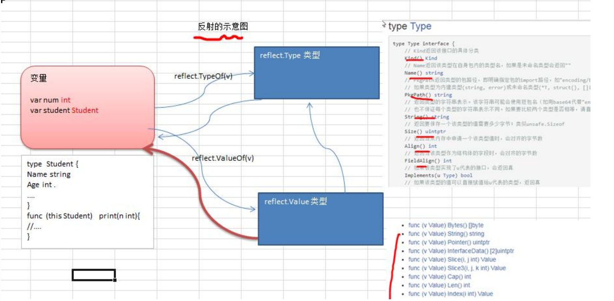
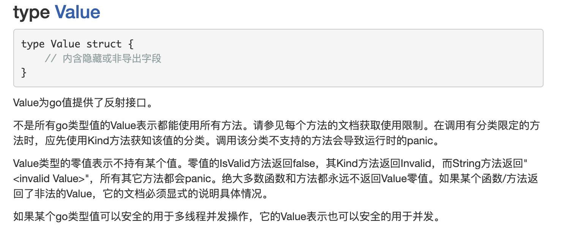
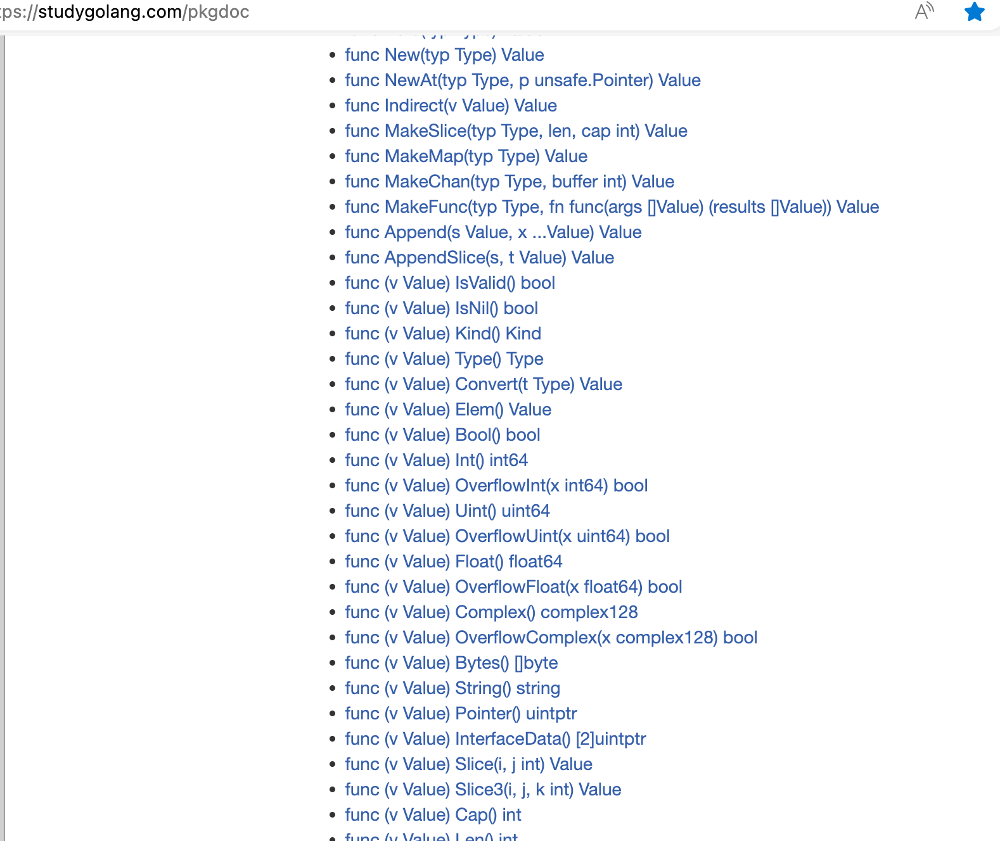
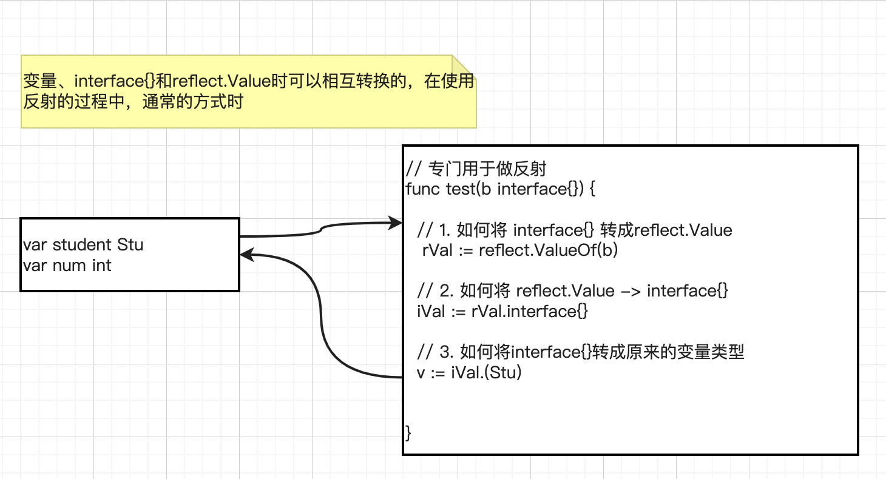
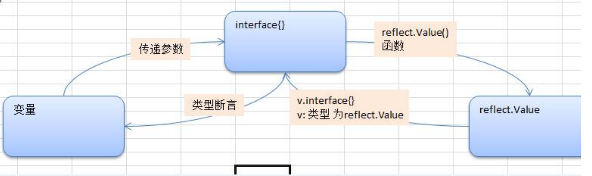

# 第17章反射

## 17.1 先看一个问题，反射的使用场景

```go
package main

import (
    "encoding/json"
    "fmt"
)

func main() {
    m := Monster{
       Name: "玉兔精",
       Age:  20,
       Sal:  888.99,
       Sex:  "female",
    }
    data, _ := json.Marshal(m)
    fmt.Println("json result:", string(data))
}

type Monster struct {
    Name string  `json:"monsterName"`
    Age  int     `json:"monsterAge"`
    Sal  float64 `json:"monsterSal"`
    Sex  string  `json:"monsterSex"`
}
```

> 输出结果：
>
> json result: {"monsterName":"玉兔精","monsterAge":20,"monsterSal":888.99,"monsterSex":"female"}
>
> 思考问题：
>
> 为什么序列化后，key-val 的key值时结构体Tag的值，而不是字段的名称，比如：不是Name而是
>
> monsterName
>
> **引出反射**：学习完reflect之后，回头再开看看

## 17.2 使用反射机制，编写函数的适配器, 桥连接

```go
// 1）定义了两个匿名函数
test1 := func(v1 int, v2 int) {
  t.Log(v1, v2)
}

test2 := func(v1 int, v2 int, s string) {
  t.Log(v1, v2, s)
}

// 2) 定义一个适配器函数用作统一处理接口，其大致结构如下：
bridge := func(call interface{}, args ...interface{}) {
   // 内容
}
// 实现调用test1对应的函数
bridge(test1, 1, 2)
// 实现调用test2对应的函数
bridge(test2, 1, 2, "test2")

// 3) 要求使用反射机制完成(note：学习reflect后，回头来解决)
```

## 17.3 反射的基本介绍

### 17.3.1 基本介绍

1) 反射可以在运行时动态获取变量的各种信息, 比如变量的类型(type)，类别(kind) 
2) 如果是结构体变量，还可以获取到结构体本身的信息(包括结构体的字段、方法) 
3) 通过反射，可以修改变量的值，可以调用关联的方法。 
4) 使用反射，需要 import (“reflect”)

5) 示意图



### 17.3.2 反射的应用场景

发射常见应用场景有以下两种

1）不知道接口调用哪个函数，根据传入参数在运行时确定调用的具体接口，这种需要对函数或方法反射。例如一下这种桥接模式，比如我前面提出问题。

```go
func bridge(funcPtr interface{}, args ...interface{})
```

第一个参数funcPtr以接口的形式传入函数指针，函数参数args以可变参数的形式传入，bridge函数中可以用反射来动态执行funcPtr函数

2）对结构体序列化时，如果结构体有指定Tag，也会使用反射生成对应的字符串

```go
package main

import (
    "encoding/json"
    "fmt"
)

func main() {
    m := Monster{
       Name: "玉兔精",
       Age:  20,
       Sal:  888.99,
       Sex:  "female",
    }
    data, _ := json.Marshal(m)
    fmt.Println("json result:", string(data))
}

type Monster struct {
    Name string  `json:"monsterName"`
    Age  int     `json:"monsterAge"`
    Sal  float64 `json:"monsterSal"`
    Sex  string  `json:"monsterSex"`
}
```

### 17.3.3 反射重要的函数和概念

1) reflect.TypeOf(变量名)，获取变量的类型，返回reflect.Type类型

2. reflect.ValueOf(变量名)，获取变量的值，返回reflect.Value类型reflect.Value 是一个结构体类型。【**看文档**】,通过reflect.Value，可以获取关于变量的很多信息。





3) 变量、interface{} 和 reflect.Value 是可以相互转换的，这点在实际开发中，会经常使用到。画出示意图





## 17.4 反射的快速入门 

### 17.4.1 快速入门说明

请编写一个案例，演示对(基本数据类型、interface{}、reflect.Value)进行反射的基本操作代码演示，

见下面的表格：

```java
func main() {
	// 请编写一个案例，演示对(基本数据类型、interface{}、reflect.Value)进行反射的基本操作
	var num int = 100
	reflectTest01(num)
}

// 专门演示反射
func reflectTest01(b interface{}) {
    // 通过反射获取的传入的变量的 type , kind, 值

    // 1. 先获取到 reflect.Type
    rTyp := reflect.TypeOf(b)
    fmt.Println("rTyp=", rTyp)

    // 2. 获取到reflect.Value
    rVal := reflect.ValueOf(b)
    // 这里不能直接 2 + rVal，rVal是reflect.Value类型
    n2 := 2 + rVal.Int()
    fmt.Println("n2=", n2)

    fmt.Printf("rVal=%v rVal type=%T\n", rVal, rVal)

    // 下面我们将 rVal 转成 interface{}
    iV := rVal.Interface()

    // 将interface{} 通过断言转成需要的类型
    num2 := iV.(int)
    fmt.Println("num2=", num2)
}
```

请编写一个案例，演示对(结构体类型、interface{}、reflect.Value)进行反射的基本操作

代码演示：

```go
func main() {
	//2. 定义一个 Student 的实例
	stu := Student{
		Name: "tom",
		Age:  20,
	}
	reflectTest02(stu)
}

// 专门演示反射[对结构体的反射]
func reflectTest02(b interface{}) {
    // 通过反射获取的传入的变量的 type , kind, 值
    // 1. 先获取到 reflect.Type
    vTyp := reflect.TypeOf(b)
    fmt.Println("vTyp=", vTyp)

    // 2. 获取到reflect.Value
    rVal := reflect.ValueOf(b)

    // 下面我们将 rVal 转成 interface{}
    iV := rVal.Interface()
    fmt.Printf("iv=%v iv type=%T \n", iV, iV)

    // 将 interface{} 通过断言转成需要的类型
    // 这里，我们就简单使用了一带检测的类型断言
    // 同学们可以使用 swtich 的断言形式来做的更加的灵活
    stu, ok := iV.(Student)
    if ok {
       fmt.Printf("stu.Name=%v\n", stu.Name)
    }
}
```

## 17.5 反射的注意事项和细节
